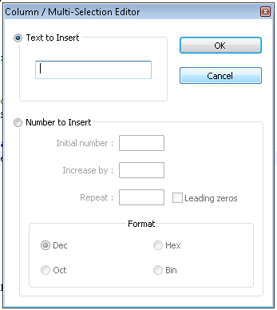
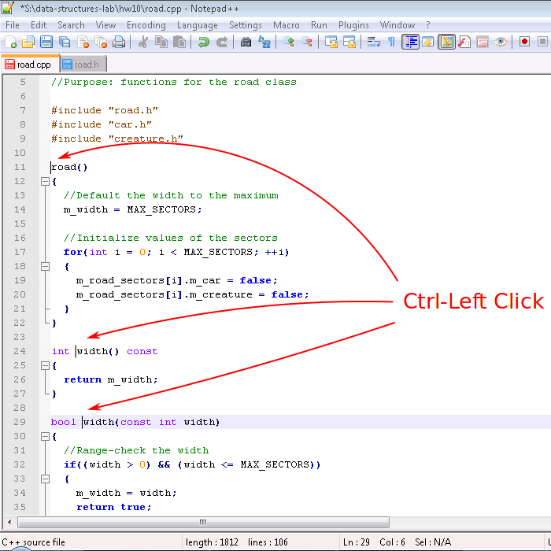

# Exploring Text Editors

## Motivation

At this point your Computer Science career, you've worked with at least one text editor: `jpico`.
Love it or hate it, `jpico` is a useful program for reading and writing **plain ASCII text**.
C++ programs[^others-too] are written in plain ASCII text.
ASCII is a convenient format for humans and programs[^compilers] alike to read and process.

Because of its simple and featureless interface, many people find editors like `jpico` to be frustrating to use.
Many users miss the ability to use a mouse or simply copy/paste lines from files without bewildering keyboard shortcuts.

Fortunately, there are myriad text editors available.
Many of the more popular options are available to you on campus machines and can be installed on your person computers as well!
These editors offer many features that may (hopefully) already be familiar to you.
Such features include:

- Syntax highlighting
- Cut, copy, and paste
- Code completion

Whether you're writing programs, viewing saved program output, or editing Markdown files, you will often find yourself in need of a text editor.
Learning the features of a specific text editor will make your life easier when programming.
In this lab, you will try using several text editors with the goal of finding one that fits your needs.

Several of the editors you will see do not have a graphical user interface (GUI).
Although the ability to use a mouse is comfortable and familiar, don't discount the console editors!
Despite their learning curves, many experienced programmers strongly prefer console editors due to their speed, stability, and convenience.
Knowing a console editor is also handy in situations where you need to edit files on a machine halfway around the globe[^globe]!

**Note:** This chapter focuses on text editors; integrated development environments will be discussed later in the semester.
Even if you prefer to use an IDE for development, you will still run into situations where a simple text editor is more convenient to use.

### Takeaways

- Recognize the value of plain text editors.
- Familiarize yourself with different text editors available on campus machines.
- Choose a favorite editor; master it.

## Walkthrough

**Note**: Because this is your first pre-lab, the walkthrough will be completed in class.

For each:

- Helpful URLs (main website) / tutorial mode
- Special terminology
- Moving around text, cut/copy/paste, nifty editing features
- Multiple files, tabs/splits
- Nifty features (e.g. notepad++ doc map)
- Configuring things; handy config settings
- Plugins

### Notepad++

[Notepad++](https://notepad-plus-plus.org/)[^npp] is a popular text editor for Windows.
It is free, easy to install, and sports a variety of features including syntax highlighting and automatic indetation.
Many people choose this editor because it is lightweight and easy to use.

#### Keyboard shortcuts

Beyond the standard editing shortcuts that most programs use, Notepad++ has some key shortcuts that come in handy when programming.
Word- and line-focused shortcuts are useful when editing variable names or rearranging snippets of code.
Other shortcuts indent or outdent[^outdent] blocks of code or insert or remove comments.

In addition to those shortcuts, if your cursor is on a brace, bracket, or parenthesis, you can jump to the matching brace, bracket, or parenthesis with \keys{\ctrl+b}.

##### Word-based shortcuts
- \keys{\ctrl+\arrowkeyleft} / \keys{\arrowkeyright}: Move cursor forward or backward by one word
- \keys{\ctrl+\backdel}: Delete to start/end of word

##### Line-based shortcuts
- \keys{\ctrl+\shift+\backspace}: Delete to start/end of line
- \keys{\ctrl+l}: Delete current line
- \keys{\ctrl+t}: Transpose (swap) current and previous lines
- \keys{\ctrl+\shift+\arrowkeyup} / \keys{\arrowkeydown}: Move current line/selection up or down
- \keys{\ctrl+d}: Duplicate current line
- \keys{\ctrl+j}: Join selected lines

##### Indenting and commenting code

- \keys{\tab}: Indent current line/block
- \keys{\shift+\tab}: Outdent current line/block
- \keys{\ctrl+q}: Single-line comment/uncomment current line/selection
- \keys{\ctrl+\shift+q}: Block comment curent line/selection

#### Column Editing

You can also select text in columns, rather than line by line.
To do this, use \keys{\Alt+\shift+\arrowkeyup} / \keys{\arrowkeydown} / \keys{\arrowkeyleft} / \keys{\arrowkeyright} to perform a column selection, or hold
\keys{\Alt} and left-click.

If you have selected a column of text, you can type to insert text on each line in the column or edit as usual (e.g., \keys{\del} deletes the selection or one character from each line).
Notepad++ also features a column editor that can insert text or a column of increasing numbers. When you have performed a column selection, press \keys{\Alt+c} to open it.

#### Multiple Cursors

Notepad++ supports multiple cursors, allowing you to edit text in multiple locations at once.
To place multiple cursors, hold \keys{\ctrl} and left-click everywhere you want a cursor.
Then, you can type as normal and your edits will appear at each cursor location.

For example, suppose we've written the declaration for a class named `road` and that we've copied the member function declarations to an implementation file.
We want to scope them (`road::width()` instead of `width()`), but that's tedious to do one function at a time.
With multiple cursors, though, you can do that all in one go!

<!-- TODO: fix image sizes so these fit on one page -->

First, place a cursor at the beginning of each function name:

<!-- TODO: can't use \keys{\ctrl} in captions??? -->

Then, type `road::`. Like magic, it appears in front of each function:

#### Document Map

A document map can be handy when navigating large files[^large].
It shows a bird's-eye view of the document; you can click to jump to particular locations.

The document map can be enabled by clicking \menu{View > Document Map}

#### Settings

Notepad++ has a multitude of settings that can configure everything from syntax highlight colors to keyboard shortcuts.
You can even customize some settings per programming language, including indentation.
One common setting is to switch Notepad++ to use spaces instead of tabs:

#### Plugins

Notepad++ has support for plugins; you can see a list of them [here](http://docs.notepad-plus-plus.org/index.php?title=Plugin_Central)[^npp-plugins].
Unfortunately, plugins must be installed to the same directory Notepad++ is installed in, so you will need to install Notepad++ yourself to use plugins.

### Atom

### JPico

### Vim

### Emacs

## Questions

**Note**: Because this is your first pre-lab, questions will be answered in class.

## Quick Reference

- How to get out of an editor / help everything is broken
- Doing common stuff: open file, save, motion commands

## Further Reading

- Helpful URLs (main website, downloads, package index, tutorial, etc.) / tutorial mode

[^others-too]: And many other programming languages, for that matter.
[^compilers]: Including compilers.
[^globe]: Thanks to cloud computing, this is becoming commonplace, yo.
[^npp]: Website: [https://notepad-plus-plus.org/](https://notepad-plus-plus.org/)
[^large]: Of course, this feature might encourage making large files rather than multiple manageable files...
[^outdent]: *Outdent* (verb). Latin: To remove a tooth; English: The opposite of indent.
[^npp-plugins]: [http://docs.notepad-plus-plus.org/index.php?title=Plugin_Central](http://docs.notepad-plus-plus.org/index.php?title=Plugin_Central)
