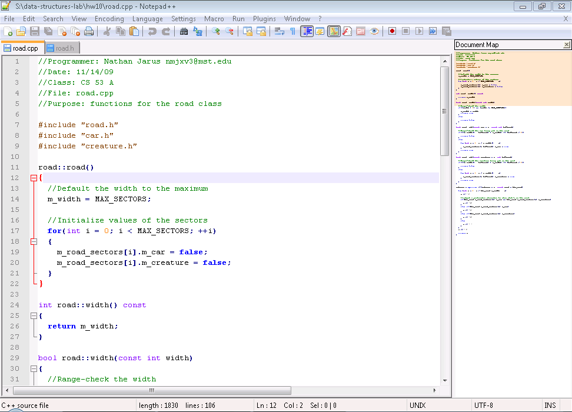
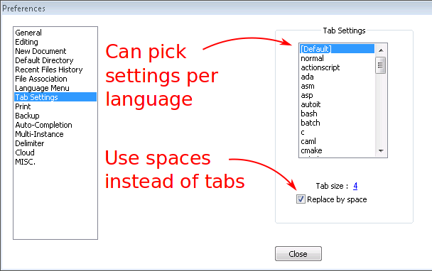
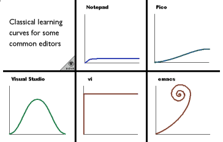

# Exploring Text Editors

## Motivation

At this point your Computer Science career, you've worked with at least one text editor: `jpico`.
Love it or hate it, `jpico` is a useful program for reading and writing **plain ASCII text**.
C++ programs[^others-too] are written in plain ASCII text.
ASCII is a convenient format for humans and programs[^compilers] alike to read and process.

Because of its simple and featureless interface, many people find editors like `jpico` to be frustrating to use.
Many users miss the ability to use a mouse or simply copy/paste lines from files without bewildering keyboard shortcuts.

Fortunately, there are myriad text editors available.
Many of the more popular options are available to you on campus machines and can be installed on your personal computers as well!
These editors offer many features that may (hopefully) already be familiar to you.
Such features include:

- Syntax highlighting
- Cut, copy, and paste
- Code completion

Whether you're writing programs, viewing saved program output, or editing Markdown files, you will often find yourself in need of a text editor.
Learning the features of a specific text editor will make your life easier when programming.
In this lab, you will try using several text editors with the goal of finding one that fits your needs.

Several of the editors you will see do not have a graphical user interface (GUI).
Although the ability to use a mouse is comfortable and familiar, don't discount the console editors!
Despite their learning curves, many experienced programmers still prefer console editors due to their speed, stability, and convenience.
Knowing a console editor is also handy in situations where you need to edit files on a machine halfway around the globe[^globe]!

**Note:** This chapter focuses on text editors; integrated development environments will be discussed later in the semester.
Even if you prefer to use an IDE for development, you will still run into situations where a simple text editor is more convenient to use.

### Takeaways

- Recognize the value of plain text editors.
- Familiarize yourself with different text editors available on campus machines.
- Choose a favorite editor; master it.

## Walkthrough

**Note**: Because this is your first pre-lab, the walkthrough will be completed in class.

For each:

- Helpful URLs (main website) / tutorial mode
- Special terminology
- Moving around text, cut/copy/paste, nifty editing features
- Multiple files, tabs/splits
- Nifty features (e.g. notepad++ doc map)
- Configuring things; handy config settings
- Plugins

### Notepad++

[Notepad++](https://notepad-plus-plus.org/)[^npp] is a popular text editor for Windows.
It is free, easy to install, and sports a variety of features including syntax highlighting and automatic indentation.
Many people choose this editor because it is lightweight and easy to use.

#### Keyboard shortcuts

Beyond the standard editing shortcuts that most programs use, Notepad++ has some key shortcuts that come in handy when programming.
Word- and line-focused shortcuts are useful when editing variable names or rearranging snippets of code.
Other shortcuts indent or outdent[^outdent] blocks of code or insert or remove comments.

In addition to those shortcuts, if your cursor is on a brace, bracket, or parenthesis, you can jump to the matching brace, bracket, or parenthesis with \keys{\ctrl+b}.

##### Word-based shortcuts

- \keys{\ctrl+\arrowkeyleft} / \keys{\arrowkeyright}: Move cursor forward or backward by one word
- \keys{\ctrl+\backdel}: Delete to start/end of word

##### Line-based shortcuts

- \keys{\ctrl+\shift+\backspace}: Delete to start/end of line
- \keys{\ctrl+l}: Delete current line
- \keys{\ctrl+t}: Transpose (swap) current and previous lines
- \keys{\ctrl+\shift+\arrowkeyup} / \keys{\arrowkeydown}: Move current line/selection up or down
- \keys{\ctrl+d}: Duplicate current line
- \keys{\ctrl+j}: Join selected lines

##### Indenting and commenting code

- \keys{\tab}: Indent current line/block
- \keys{\shift+\tab}: Outdent current line/block
- \keys{\ctrl+q}: Single-line comment/uncomment current line/selection
- \keys{\ctrl+\shift+q}: Block comment curent line/selection

#### Column Editing

You can also select text in columns, rather than line by line.
To do this, use \keys{\Alt+\shift+\arrowkeyup} / \keys{\arrowkeydown} / \keys{\arrowkeyleft} / \keys{\arrowkeyright} to perform a column selection, or hold
\keys{\Alt} and left-click.

If you have selected a column of text, you can type to insert text on each line in the column or edit as usual (e.g., \keys{\del} deletes the selection or one character from each line).
Notepad++ also features a column editor that can insert text or a column of increasing numbers. When you have performed a column selection, press \keys{\Alt+c} to open it.

\begin{figure}[!h]
	\centering
	\includegraphics[height=0.5\textheight]{01/npp-column-editor.png}
	\caption{Column Editor}
\end{figure}

#### Multiple Cursors

Notepad++ supports multiple cursors, allowing you to edit text in multiple locations at once.
To place multiple cursors, hold \keys{\ctrl} and left-click everywhere you want a cursor.
Then, you can type as normal and your edits will appear at each cursor location.

For example, suppose we've written the declaration for a class named `road` and that we've copied the member function declarations to an implementation file.
We want to scope them (`road::width()` instead of `width()`), but that's tedious to do one function at a time.
With multiple cursors, though, you can do that all in one go!

<!-- TODO: fix image sizes so these fit on one page -->
\newpage
First, place a cursor at the beginning of each function name:
\begin{figure}[!h]
	\centering
	\includegraphics[height=0.4\textheight]{01/npp-mult-cursors-1.PNG}
	\caption{Placing multiple cursors with Ctrl + left-click}
\end{figure}
<!-- TODO: can't use \keys{\ctrl} in captions??? -->

Then, type `road::`. Like magic, it appears in front of each function:
\begin{figure}[!h]
	\centering
	\includegraphics[height=0.4\textheight]{01/npp-mult-cursors-2.PNG}
	\caption{Typing \texttt{road::} inserts that text at each cursor location}
\end{figure}

#### Document Map

A document map can be handy when navigating large files[^large].
It shows a bird's-eye view of the document; you can click to jump to particular locations.

The document map can be enabled by clicking \menu{View > Document Map}



#### Settings

Notepad++ has a multitude of settings that can configure everything from syntax highlight colors to keyboard shortcuts.
You can even customize some settings per programming language, including indentation.
One common setting is to switch Notepad++ to use spaces instead of tabs:



#### Plugins

Notepad++ has support for plugins; you can see a list of them [here](http://docs.notepad-plus-plus.org/index.php?title=Plugin_Central)[^npp-plugins].
Unfortunately, plugins must be installed to the same directory Notepad++ is installed in, so you will need to install Notepad++ yourself to use plugins.

### Atom

### JPico

`jpico` is a command-line text editor for Linux, Windows, and macOS.
People choose this editor because it is easy to use (as command-line editors go), has syntax highlighting, and is usually installed on Linux systems.
It may seem simple, but it has a surprising number of features that most people are unaware of.
Many features draw inspiration from `emacs`, so you may observe some parallels between the two editors.

(Historical note: `jpico` is actually [`joe`](http://joe-editor.sourceforge.net/)[^joe] configured to use commands similar to [`pico`](http://www.guckes.net/pico/)[^pico].
`pico` is a small (eh? eh?) text editor that came with the PINE newsreader[^news] and was designed to be easy to use[^nerds].)

#### How to Get Help

At the top of the `jpico` screen is a window with help information. You can toggle it on and off with \keys{\ctrl + g}.
There are several pages of help information.
To scroll forwards through the pages, press \keys{\esc} and then \keys{.}; to scroll backwards, press \keys{\esc} and then \keys{,}.

The notation for controls may be unfamiliar to you. In Unix-land, `^` is shorthand for the \keys{\ctrl} key.
So, for instance, `^X` corresponds to \keys{\ctrl + x}.
For historical reasons[^esc], pressing \keys{\ctrl + [} is the same as pressing \keys{\esc}, so something like `^[K` corresponds to \keys{\esc}, then \keys{k}.

The `joe` website contains more detailed documentation, but the key mappings are different.
It is still useful as an explanation behind the rather terse help messages in `jpico`!

#### Moving Around

If you'd rather exercise your pinky finger (i.e., press \keys{\ctrl} a lot) than use the arrow keys, you can move your cursor around with some commands:

- \keys{\ctrl + f}: Forward (right) one character
- \keys{\ctrl + b}: Back (left) one character
- \keys{\ctrl + p}: Up one line
- \keys{\ctrl + n}: Down one line
- \keys{\ctrl + a}: Beginning of line
- \keys{\ctrl + e}: End of line

You can also move by word; \keys{\ctrl+Space} moves forward one word, and \keys{\ctrl +z} moves back one word.

\keys{PgUp} and \keys{PgDn} move up and down one screen at a time. Alternatively, \keys{\ctrl+y} and \keys{\ctrl+v} do the same thing.

Analogously, to jump to the beginning of a file, press \keys{\ctrl+w} \keys{\ctrl+y}, and to jump to the end, \keys{\ctrl+w} \keys{\ctrl+v}.

If there's a particular line number you want to jump to (for instance, if you're fixing a compiler error), press \keys{\ctrl+w} \keys{\ctrl+t}, then type the line number to go to and press \keys{\enter}.

Deleting text is the same as cutting text in `jpico`. See the **Copy and Paste** section for a list of ways to delete things.

#### Undo and Redo

These are pretty easy. Undo is \keys{\esc},\keys{-}; redo is \keys{\esc},\keys{=}.

#### Copy and Paste

<!-- TODO mention using PuTTY clipboard -->

You: "So, `jpico` is kinda cool. But \keys{\ctrl+c} and \keys{\ctrl+v} both mean something other than 'copy' and 'paste'. Can't I just use the normal clipboard?"

Ghost of UNIX past: "It's 1969 and what on earth is a clipboard?"

You: "You know, the thing where you select some text and then copy it and you can paste that text somewhere else."

GOUP: "It's 1969 and what is 'select some text'?????"

You: "Uh, you know, maybe with the mouse, or with the cursor?"

GOUP: "The what now?"

You: "????"

GOUP: "????"

You: "?????????"

GOUP: "?????????!"

Seriously, though, the concept of a system-wide clipboard wasn't invented until the 1980s, when GUIs first became available.[^teletype]
Before that, every terminal program had to invent its own copy/paste system!
Some programs, including `jpico`, don't just have *a* clipboard--they have a whole buffer
(usually called a 'killring', which sounds like a death cult)
of everything you've cut that you can cycle through!

There are a number of ways to cut (or delete) things:

- \keys{\ctrl + d}: Cut a character
- \keys{\esc},\keys{d}: Cut from the cursor to the end of the current word
- \keys{\esc},\keys{h}: Cut from the cursor to the beginning of the current word
- \keys{\ctrl + k}: Cut a line
- \keys{\esc},\keys{k}: Cut from the cursor to the end of the line

You can repeat a cut command to add more to the last thing cut.
For example, to cut several lines at once, just keep pressing \keys{\ctrl + k}.
When you paste, all the lines will get pasted as one piece of text.

If you want to cut a selection of text, press \keys{\ctrl + \shift + 6} to start selecting text.
Move the cursor around like normal; once you have completed selecting, press \keys{\ctrl + k} to cut the selection.

Cut text goes to the killring. To paste the last thing cut, press \keys{\ctrl + u}.
To paste something else from the killring, press \keys{\ctrl+u}, then press \keys{\esc},\keys{u} until the desired text appears.

#### Search and Replace

\keys{\ctrl+w} lets you search for text. Type the text you want to search for and press \keys{\enter}.
`jpico` displays the following options:

`(I)gnore (R)eplace (B)ackwards Bloc(K) (A)ll files NNN (^C to abort):`

From here, you can:

- Press \keys{\enter} to search forwards
- Press \keys{i} to search forward and ignore the case (so searching for "bob" will match "Bob" as well)
- Press \keys{b} to search backwards
- Press \keys{r} to replace matches with a new string. `jpico` will prompt whether or not to replace for each match
- Press \keys{k} to select from the current mark (set with \keys{\ctrl + \shift + 6) to the first match
- Press \keys{a} to search in all open files
- Enter a number to jump to the N-th next match

#### Multiple Files

`jpico` can open multiple files and has some support for displaying multiple files on the screen at once.

To open another file, press \keys{\esc},\keys{e}, then enter the name of the file to open.
If you press \keys{\tab}, `jpico` will show you a listing of files matching what you've typed in so far.

<!--TODO fix alignment -->
\newpage
You can split the screen horizontally with \keys{\esc},\keys{o}.
Switch between windows with \keys{\esc},\keys{n} and \keys{\esc},\keys{p}.
You can adjust the size of the window with \keys{\esc},\keys{g} and \keys{\esc},\keys{j}.

\begin{figure}[!h]
	\centering
	\includegraphics[height=0.3\textheight]{01/jpico-two-split.png}
	\caption{\texttt{jpico} with two files open on screen}
\end{figure}

To either show only the current window or to show all windows, press \keys{\esc},\keys{i}.

\begin{figure}[!h]
	\centering
	\includegraphics[height=0.3\textheight]{01/jpico-zoom-out.png}
	\caption{\texttt{jpico} `zoomed out' to show three open files at once}
\end{figure}

#### Configuration

`jpico` looks for a configuration file in `~/.jpicorc`, or, failing that, in `/etc/joe/jpicorc`.
To change `jpico`'s configuration, first copy the default config file to your home directory:

```
cp /etc/joe/jpicorc ~/.jpicorc
```

Each setting follows the form `-settingname options`. If there is whitespace between the `-` and the start of the line, the setting is disabled.

Some handy options:

- `-istep 4`: sets indentation width to 4 columns
- `-spaces`: uses spaces for indentation, rather than tabs
- `-mouse`: enables the mouse!

(You can read more about mouse support [here](https://sourceforge.net/p/joe-editor/mercurial/ci/default/tree/docs/man.md#xterm-mouse-support)[^jpico-mouse].)

### Emacs

Emacs is a command-line and GUI text editor for Linux, Windows, and macOS.
Many joke that Emacs is so featureful that it is the only program you need to have installed on any computer.
Some have taken this to an extreme and shown as a proof of concept that you can use Emacs as your operating system.
Although that's a fun fact, you shouldn't actually do that.

Emacs was originally developed using a keyboard known as the [space-cadet keyboard](https://en.wikipedia.org/wiki/Space-cadet_keyboard).
Its layout is similar to, though notably different from today's typical keyboard layout.
One such difference is that the space-cadet had a Meta key, which we no longer have today.
Another difference is the layout of modifier keys.
Many of the Emacs keybindings (keyboard shortcuts, sort of) felt natural for space-cadet users but feel like insane acrobatics today.
When starting to use Emacs, many users will find that reaching for Alt, Control, and Escape leaves their pinky fingers feeling tired and swollen.
This has known as "Emacs pinky".
Prolonged use of Emacs will lead to inhuman pinky strength which can be used with measurable success in combat situations.

Success with Emacs boils down to your development of muscle memory for its vast collection of keybindings.
Once you have the basics down, you will find yourself angry about having to ever use a mouse.
Emacs provides a tutorial that you can access from any Emacs installation.
After launching Emacs, simply type \keys{\ctrl+h} followed by \keys{\ctrl+t} to start the tutorial.
The tutorial is just like any other editable file, so you can play with it as you please.
When you're done, simply exit Emacs with \keys{\ctrl+x} followed by \keys{\ctrl+c}.
Your changes to the tutorial won't be saved.

#### Starting Emacs

The command used to start Emacs is simply `emacs`.
Just like `jpico`, you can open specific files by listing them as arguments to the command.

~~~shell
$ emacs main.cpp
~~~

When it starts, Emacs will first check to see whether or not it has the ability to open any GUI windows for you[^emacs-gui].
Assuming it can, Emacs will opt to start its GUI interface.
The Emacs GUI is no more featureful than the command-line interface.
Sure, you have the ability to reach for your mouse and click the Cut button, but that is no faster than simply typing \keys{\ctrl+k}.

In the name of speed and convenience, many Emacs users choose to skip the GUI.
You can start Emacs without a GUI by running `emacs -nw`.
The `-nw` flag tells Emacs[^shorter-letter]...

> Dear Emacs,
>
> I know you're very fancy, and you can draw all sorts of cute shapes. That
> scissor you got there is dandy, and your save button looks like a floppy disk
> isn't that so great?
>
> Please don't bother with any of that, though. I just want you to open in the
> command-line like jpico, so that I can get some work done and move on with my life.
>
> With love,
> Me, the user.

If you choose to use the GUI, you should be aware of the following: **Emacs is still quirky and it is not going to behave like Notepad++ or Atom**.
Cut, copy, and paste, for example, are not going to work the way you expect.
It is really worth your time to get familiar with Emacs before you jump in blind.

#### Keybindings

To use Emacs (at all, really) you need to know its keybindings.
Keybindings are important enough that this little bit of information deserves its own section.

Keybindings can be thought of one or more keyboard shortcut.
You may have to type a **series** of things in order to get things to work.
What's more -- if you mess up, you'll likely have to start again from scratch.

Keybindings are read right to left using the following notation:

- The `C-` prefix indicates you need to hold the Control key while you type
- The `M-` prefix indicates you need to hold the Alt key (formerly Meta key) while you type
- Anything by itself you type **without** a modifier key.

Here are a handful of examples:

- `C-f` (\keys{\ctrl+f}) -- Move your cursor forward one character
- `M-w` (\keys{\Alt+w})-- Copy a region
- `C-x C-c` (\keys{\ctrl+x} followed by \keys{\ctrl+c}) -- Exit Emacs
- `C-u 8 r` (\keys{\ctrl+u} followed by \keys{8} followed by \keys{r}) -- Type 8 lowercase `r`'s in a row.

You can always ask Emacs what a keybinding does using `C-h k <keybinding>`.
For example,

- `C-h k C-f` -- What does `C-f` do?
- `C-h k C-x C-c` -- What does `C-x C-c` do?

Finally, if you done goofed, you can always tell Emacs to cancel your keybinding-in-progress.
Simply type `C-g`.
According to the Emacs help page...

> C-g runs the command keyboard-quit... this character quits directly.
> At a top-level, as an editor command, this simply beeps.

As mentioned, you can also use `C-g` to get your fill of beeps.

#### Executing Extended Commands

It is worth mention that every keybinding just runs a function in Emacs.
For example, `C-f` (which moves your cursor forward) runs a function called `forward-char`.
You can run any function by name using `M-x`.
`M-x` creates a little command prompt at the very bottom of Emacs.
Simply type the name of a command there and press Enter to run it.

For example, if you typed `M-x` and entered `forward-char` in the prompt and pressed Enter, your cursor would move forward one character.
Granted, that requires... 13?... More keystrokes than `C-f`, but by golly, you can do it!

`M-x` is *very* useful for invoking commands that don't actually have keybindings.

#### Moving Around

Although you can use your arrow keys to move your cursor around, you will feel much fancier if you learn the proper keybindings to do so in Emacs.

Moving by character:
- `C-f` Move forward a character
- `C-b` Move backward a character

Moving by word:
- `M-f` Move forward a word
- `M-b` Move backward a word

Moving by line:
- `C-n` Move to next line
- `C-p` Move to previous line

Moving around lines:
- `C-a` Move to beginning of line
- `C-e` Move to end of line

Moving by sentence:
- `M-a` Move back to beginning of sentence
- `M-e` Move forward to end of sentence

Scrolling by page:
- `C-v` Move forward one screenful (Page Down)
- `M-v` Move backward one screenful (Page Up)

Some other useful commands:
- `C-l` Emacs will keep your cursor in place and shift the text within your window.
  Try typing `C-l` a few times in a row to see what it does.
- `C-s` starts search.
  After you type `C-s`, you will see a prompt at the bottom of Emacs.
  Simply type the string you're searching for and press Enter.
  Emacs will highlight the matches one at a time.
  Continue to type `C-s` to scroll through all the matches in the document.
  `C-g` will quit.

#### Undo and Redo

Type `C-_` to undo the last operation.
If you type `C-_` repeatedly, Emacs will continue to undo actions as far as it it can remember.

The way Emacs saves actions takes a little getting used to.
Undo actions are, themselves, undo-able.
The consequences of this are more obvious when you play around with `C-_` yourself.

To add further quirkiness, Emacs doesn't have redo.
So don't mess up, or you're going to have to undo all your undoing.

#### Saving and Quitting

You can save a document with `C-x C-s`.
If necessary, Emacs will prompt you for a file name.
Just watch the bottom of Emacs to see if it's asking you any questions.

You can quit Emacs with `C-x C-c`.
If you have anything open that has not been saved, Emacs will prompt you to see if you really want to quit.

#### Kill and Yank

In Emacs, your "copied" and "cut" information is stored in the "kill ring"[^violent].
The kill ring is... a ring that stores things you've killed (cut), so that you can yank (paste) them later.

Vocabulary:
- **Kill**[^violent] - Cut
- **Yank** - Paste

In order to kill parts of a file, you'll need to be able to select them.
You can select a region by first setting a mark at your current cursor location with `C-space`.
Then, simply move your cursor to highlight the stuff you want to select.
Use `C-w` to kill the selection and add it to your kill ring.
You can also use `M-w` to kill the selection without actually removing it (copy instead of cut).

If you want to get content out of your kill ring, you can "yank" it out with `C-y`.
By default, `C-y` will yank whatever you last killed.
You can follow `C-y` with `M-y` to circle through other things you've previously killed.
That is, Emacs will maintain a history of things you've killed.

That's right!
Emacs' kill ring is more sophisticated than a clipboard, because you can store **several** things in there.

To understand why it's called the kill **ring**, consider the following scenario:

> First, I kill "Kermit".
> Then, I kill "Ms. Piggy".
> Then, I kill "Gonzo".
>
> Next, I yank from my kill ring.
> Emacs will first yank "Gonzo".
> If I use `M-y` to circle through my previous kills, Emacs will yank "Ms. Piggy".
> If I use `M-y` again, Emacs will yank "Kermit".
>
> If I use `M-y` **again**, Emacs will yank "Gonzo" again.

You can circle through your kill ring as necessary to find previously killed content.
Emacs will simply replace the yanked text with the next thing from the kill ring.

#### Multiple Buffers and Windows

You can have several different files open in Emacs at once.
Simply use `C-x C-f` to open a new file into a new buffer.
By default, you can only see one buffer at a time.

You can switch between the buffers using `C-x b`.
Emacs will open a prompt asking for the name of the buffer you want to switch to.
You have several options for entering that name:

1. Type it! Tab-completion works, so that's handy.
2. Use your arrow keys to scroll through the names of the buffers.

If you're done with a buffer, you can kill[^violent] it (close it) using `C-x k`.

You can also see a list of buffers using `C-x C-b`.
This will open a new **window** in Emacs.

You can switch between windows using `C-x o`.
This is convenient if you want to, say, have a `.h` file and a `.cpp` file open at the same time.
`C-x b` works the same for switching buffers, so you can tell Emacs which buffer to show in each window.

You can open windows yourself, too:

- `C-x 2` (runs `split-window-below`) splits the current window in half by drawing a line left-to-right.
- `C-x 3` (runs `split-window-right`) splits the current window in half by drawing a line top-to-bottom.

And, of course, you can close windows, too.

- `C-x 0` closes the current window
- `C-x 1` closes every window **except** the current window.
   This command is **very** handy if Emacs opens too much junk.

#### Configuration and Packages

Emacs stores all of its configuration using a dialect of the Lisp programming language.
The default location of its configuration file is in your home directory in `.emacs/init.el`.
The `init.el` file contains Lisp code that Emacs runs on start up (**init**ialization).
This runs code and sets variables within Emacs to customize how it behaves.

Although you can (and sometimes have to) write your own Lisp code, it's usually easier to let Emacs do it for you.
Running the `customize` command (`M-x customize`) will start the customization tool.
You can use your normal moving-around keybindings and the Enter key to navigate through the `customize` menus.
You can also search for variables to change.

For example:

1. Run the `customize` command (`M-x customize`)
2. In the search bar, type "indent-tabs". Then move your cursor to `[ Search ]` and press Enter.
3. Locate the `Indent Tabs Mode` option and press the `[Toggle]` button by placing your cursor on it and pressing Enter.
   You'll notice that the State changes from `STANDARD` to `EDITED`.
4. Press the `[ State ]` button and choose option `1` for Save for Future Sessions.

These steps will modify your `init.el` file, so that Emacs will use spaces instead of tab characters whenever you press the tab key.
It may seem tedious, but `customize` will always write correct Lisp code to your `init.el` file.

`customize` and other more advanced commands are available by default in Emacs.
As further evidence that it is nearly its own operating system, you can install packages in Emacs using its built-in package manager.

If you run the `list-packages` command (`M-x list-packages`), you can see a list of packages available for install.
Simply scroll through the list like you would any old buffer.
For instructions on installing packages and searching for packages in unofficial software repositories, refer to the Emacs wiki.

### Vim

Vim is a command-line and GUI[^gvim] text editor for Linux, Windows, and macOS.
It is popular for its power, configurability, and the composability of its commands.

For example, rather than having separate commands for deleting words, lines, paragraphs, and the like,
Vim has a single delete command (`d`) that can be combined with motion commands to delete a word (`w`), line (`d`), paragraph (`{`), etc.
In this sense, learning to use Vim is like learning a language: difficult at first, but once you become fluent it's easy to express complex tasks.

Vim offers a tutorial: at a command prompt, run `vimtutor`.
You can also access help in Vim by typing `:help <thing you want help with>`.
The help search can be tab-completed.
To close the help window, type `:q`.

#### Getting into Insert mode

Vim is what's known as a 'modal editor'; keys have different meanings in different modes.
When you start Vim, it is in 'normal' mode; here, your keys will perform different commands -- no need to press \keys{\ctrl} all the time!
However, usually when you open a text file, you want to, you know, type some text into it.
For this task, you want to enter 'insert' mode.
There are a number of ways to put `vim` into insert mode, but the simplest is just to press \keys{i}.

Some other ways to get into insert mode:

- \keys{I}: Insert at beginning of line
- \keys{a}: Insert after cursor (append at cursor)
- \keys{A}: Insert at end of line (Append to line)
- \keys{o}: Insert on new line below cursor
- \keys{O}: Insert on new line above cursor

When in insert mode, you can move around with the arrow keys.

To get back to normal mode, press \keys{\esc} or \keys{\ctrl + c}.
(Many people who use `vim` swap \keys{Caps Lock} and \keys{\esc} to make switching modes easier.)

#### Moving around in Normal mode

In normal mode, you can move around with the arrow keys, but normal mode also features a number of motion commands for efficiently moving around files.
Motion commands can also be combined with other commands, as we will see later on.

Some common motions:

- \keys{j}/\keys{k}/\keys{h}/\keys{l}: up/down/left/right[^hjkl]
- \keys{\^{}}/\keys{\$}: Beginning/end of line
- \keys{w}: Next word
- \keys{e}: End of current word, or end of next word
- \keys{b}: Back one word
- \keys{\%}: Matching brace, bracket, or parenthesis
- \keys{gg}/\keys{G}: Top/bottom of document

Commands can be repeated a number of times; for instance, `3w` moves forward three words.

One very handy application of the motion keys is to change some text with the \keys{c} command.
For example, typing `c$` in normal mode deletes from the cursor to the end of the line and puts you in insert mode
so you can type your changes.
Repeating a command character twice usually applies it to the whole current line; so `cc` changes the whole current line.

#### Selecting text in Visual mode

Vim has a visual mode for selecting text; usually this is useful in conjunction with the change, yank, or delete commands.
\keys{v} enters visual mode; motion commands extend the selection.
If you want to select whole lines, \keys{V} selects line-by-line instead.

Vim also has a block select mode: \keys{\ctrl+v}.
In this mode, you can select and modify blocks of text similar to Notepad++'s column selection feature.
Pressing \keys{I} will insert at the beginning of the selection.
After returning to normal mode, whatever you insert on the first row is propagated to all other rows.
Likewise, \keys{c} can be used to change the contents of a bunch of rows in one go.

<!-- TODO pictures of this -->

#### Undo and Redo

To undo a change, type \keys{u}. \keys{U} undoes all changes on the current line.

To redo (undo an undo), press \keys{\ctrl + r}.

#### Saving and Quitting

In normal mode, you can save a file by typing `:w`.
To save and quit, type `:wq` or `ZZ`.

If you've saved your file already and just want to quit, `:q` quits; `:q!` lets you quit without saving changes.

#### Copy and Paste

Vim has an internal clipboard like `jpico`. The command to copy (yank, in Vim lingo) is \keys{y}.
Combine this with a motion command; `yw` yanks one word and `y3j` yanks 4 lines.
As with `cc`, `yy` yanks the current line.

In addition to yank there is the \keys{d} command to cut/delete text; it is used in the same way.

Pasting is done with \keys{p} or \keys{P}; the former pastes the clipboard contents after the character the cursor is on, the latter pastes before the cursor.

While Vim lacks a killring, it does allow you to use multiple paste registers with the \keys{''} key.
Paste registers are given one-character names; for example, `"ayy` yanks the current line into the `a` register.
`"ap` would then paste the current line elsewhere.

If you want to copy to the system clipboard, the paste register name for that is `+`. So `"+p` would paste from the system clipboard.
(To read about this register and other special registers, type `:help registers`.)

#### Indenting

You can indent code one level with \keys{$>$} and outdent with \keys{$<$}.
Like \keys{c}, these must be combined with a motion or repeated to apply to the current line.
For instance, `>%` indents everything up to the matching '}' (or bracket or parenthesis) one level.

Vim also features an auto-indenter: \keys{=}.
It is incredibly handy when copying code around.
For example, `gg=G` will format an entire file (to break the command down, `gg` moves to the top of the file, then `=G` formats to the bottom).

#### Multiple files

In Vim terminology, every open file is a 'buffer'. Buffers can be active (visible) or hidden (not on the screen).
When you start Vim, it has one window open; each window can show a buffer.

Working with buffers:

- `:e <filename>` opens (edits) a file in a new buffer. You can use tab completion here!
- `:bn` and `:bp` switch the current window to show the next or previous buffer
- `:b <filename>` switches to a buffer matching the given filename (tab completion also works here)
- `:buffers` shows a list of open buffers

Working with windows:

- `:split` splits the current window in half horizontally
- `:vsplit` splits the current window vertically
- \keys{\ctrl+w} \keys{w} switches focus to the next window
- \keys{\ctrl+w} \keys{h}/\keys{j}/\keys{k}/\keys{l} switches focus to the window above/left/right/below the current window

Vim also has tabs!

- `:tabe` edits a file in a new tab
- `gt` and `gT` switch forward and backward through tabs

To close a window/tab, type `:q`. `:qall` or `:wqall` let you close / save and close all buffers in one go.

<!-- TODO Search and Replace -->

#### Configuration

Vim's user configuration file is located at `~/.vimrc` or `~/.vim/vimrc`.
You do not need to copy a default configuration; just create one and add the configuration values you like.

Vim has a mouse mode that can be used to place the cursor or select things in visual mode.
In your config file, enter `set mouse=a`.

To use four-space tabs for indentation in Vim, the following two options should be set:
```
set tabstop=4
set expandtab
```

\newpage
## Questions

**Note**: Because this is your first pre-lab, questions will be answered in class.

For each of the following editors...

- Notepad++
- Atom
- Vim
- Emacs

... figure out how to do the following:

- Open a file
- Save a file
- Close a file
- Exit the editor
- Move your cursor around
	-     Up/down/right/left
	-     Skip words
- Edit the contents of a file
- Undo
- Cut / Copy / Paste ("Yank")
	-     Whole lines
	-     Select/highlight areas of text
- Open two files at once (tabs/splits/whatever)
	-     Change between open files
	-     View a list of open files
	-     Return to a normal view/frame (just a single file)
- Configure your editor
	-     How do you change settings? (Tab width, cleanup trailing whitespace, UI colors, etc.)

\newpage
For each editor, answer the following questions:

- What do you like about it?
\vspace{0.4\textheight}

- What do you dislike about it?

\newpage
Each editor has its own learning curves, but any seasoned programmer will tell you the value of knowing your text editor inside and out. Pick an editor and master it. If you get tired of one, try a different one!

Once you get comfortable with an editor, check out “plugins” for various languages. These can assist you as you code to correct your syntax as you go as well as various other features.



## Quick Reference

- How to get out of an editor / help everything is broken
- Doing common stuff: open file, save, motion commands

## Further Reading

### Notepad++


### JPico


### Vim

- Helpful URLs (main website, downloads, package index, tutorial, etc.) / tutorial mode


[^others-too]: And many other programming languages, for that matter.
[^compilers]: Including compilers.
[^globe]: Thanks to cloud computing, this is becoming commonplace, yo.
[^npp]: Website: [https://notepad-plus-plus.org/](https://notepad-plus-plus.org/)
[^large]: Of course, this feature might encourage making large files rather than multiple manageable files...
[^outdent]: *Outdent* (verb). Latin: To remove a tooth; English: The opposite of indent.
[^npp-plugins]: [http://docs.notepad-plus-plus.org/index.php?title=Plugin_Central](http://docs.notepad-plus-plus.org/index.php?title=Plugin_Central)
[^joe]: [http://joe-editor.sourceforge.net](http://joe-editor.sourceforge.net)
[^pico]: [http://www.guckes.net/pico/](http://www.guckes.net/pico/)
[^news]: A newsreader is a program for reading Usenet posts. Imagine Reddit, but in the 1980s.
[^nerds]: Well, easy to use for people (sometimes known as 'humanitty') who were already used to using Unix terminal programs!
[^esc]: In the '60s and '70s, \keys{\ctrl} cleared the top three bits of the ASCII code of whatever key you pressed.
The ASCII code for \keys{\esc} is `0x1B` or `0b00011011` and the ASCII code for \keys{[} is `0x5b` or `0b01011011`.
So, pressing \keys{\ctrl + [} is the same as pressing \keys{\esc}.
People (and old software) dislike change, so to this day your terminal still pretends that that's what's going on!
[^teletype]: Command-line programs even predate computer screens! Before then, people used 'teletypes'--electric typewriters that the computer could control.
They were incredibly slow to output anything, and there was no way to erase what had already been printed, so having a 'cursor' didn't really make much sense
(how would you show it?).
Some terminals didn't even have arrow keys as a result!
[^jpico-mouse]: [https://sourceforge.net/p/joe-editor/mercurial/ci/default/tree/docs/man.md#xterm-mouse-support](https://sourceforge.net/p/joe-editor/mercurial/ci/default/tree/docs/man.md#xterm-mouse-support)
[^gvim]: The graphical version is cleverly named `gvim`.
[^hjkl]: Why these letters? Two reasons: first, they're on the home row of a QWERTY keyboard, so they're easy to reach.
Second, when Bill Joy wrote `vi` (which inspired `vim`), he was using a Lear Siegler ADM-3A terminal, which didn't have individual arrow keys.
Instead, the arrow keys were placed on the h, j, k, and l keys.
This keyboard is also the reason for why ~ refers to your home directory in Linux: ~ and Home are on the same key on an ADM-3A terminal.
[^emacs-gui]: For example, if you are using X forwarding, Emacs can detect the ability to open a GUI for you.
[^shorter-letter]: Well, the `nw` in `-nw` stands for no window, but Emacs takes it much more dramatically.
[^violent]: Don't ask why Emacs has such violent terms. There's no keyboard-related excuse for that one.
