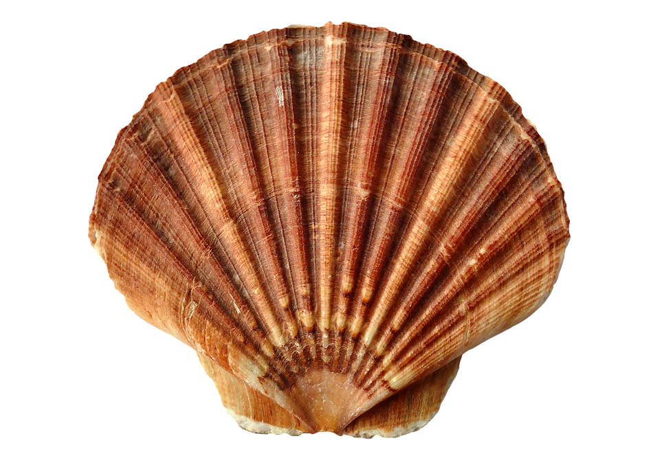

# Bash Basics

## Motivation
What is a shell?
A shell is a hard outer layer of a marine animal, found on beaches.

<!--
Licensed under CC0
source: https://pixabay.com/es/mar-shell-almeja-oc%C3%A9ano-1162744/
-->


Now that that's cleared up, on to some cool shell facts.
Did you know that shells play a vital role in the Linux operating system?
PuTTY lets you type stuff to your shell and shows you what the shell outputs.

When you log in to one of these machines, a program named `login` asks you for your username and password.
After you type in the right username and password, it looks in a particular file, `/etc/passwd`, which lists useful things about you like where your home directory is located.
This file also has a program name in it -- the name of your shell.
`login` runs your shell after it finishes setting up everything for you.

Theoretically, you can use anything for your shell, but you probably want to use a program designed for that purpose.
A shell gives you a way to run programs and view their output.
Typically they provide some built-in features as well.
Shells also keep track of things such as which directory you are currently in.

The standard interactive shell is `bash`[^bash].
There are others, however! `zsh` and `fish` are both popular.

### Takeaways

- Learn what a shell is and how to use common shell commands and features
- Become comfortable with viewing and manipulating files from the command line
- Use I/O redirection to chain programs together and save program output to files
- Consult the manual to determine what various program flags do

## Walkthrough

### My Dinner with Bash

To use bash, you enter commands and press \keys{\enter}.
Bash will run the corresponding program and show you the resulting output.

Some commands are very simple to run.
Consider `pwd`:

~~~ shell
nmjxv3@rc02xcs213:~$ pwd
/usr/local/home/njmxv3
~~~

When you type `pwd` and press \keys{\enter}, bash runs `pwd` for you.
In turn, `pwd` outputs your **p**resent **w**orking **d**irectory (eh? eh?) and bash shows it to you.

#### Arguments

Some commands are more complex.
Consider `g++`:

~~~ shell
nmjxv3@rc02xcs213:~$ g++ main.cpp
~~~

`g++` needs more information than `pwd`.
After all, it needs *something* to compile.

In this example, we call `main.cpp` a **command line argument**.
Many programs require command line arguments in order to work.
If a program requires more than one argument, we simply separate them with spaces.[^spaces]

#### Flags

In addition to command line arguments, we have **flags**.
A flag starts with one or more `-` and may be short or long.
Consider `g++` again:

~~~ shell
nmjxv3@rc02xcs213:~$ g++ -Wall main.cpp
~~~

Here, we pass a command line argument to `g++`, as well as a flag: `-Wall`.
`g++` has a set of flags that it knows.
Each flag turns features on or off.
In this case, `-Wall` asks `g++` to turn on *all warnings*.
If *anything* looks fishy in `main.cpp`, we want to see a compiler warning about it.

#### Reading Commands in this Course

Some flags are optional; some command line arguments are optional.
In this course, you will see **many** different commands that take a variety of flags and arguments.
We will use the following notation with regard to optional or required flags and arguments:

- If it's got angle brackets (`<>`) around it, it's a placeholder.
  **You** need to supply a value there.
- If it's got square brackets (`[]`) around it, it's optional.
- If it doesn't have brackets, it's required.

For example:

- `program1 -f <filename>`
    - A `filename` argument is required, but you have to provide it in the specified space
- `program2 [-l]`
    - The `-l` flag is optional. Pass it only if you want/need to.
- `program3 [-l] <filename> [<number of cows>]`
    - The `-l` flag is optional. Pass it only if you want/need to.
    - A `filename` argument is required, but you have to provide it in the specified space
    - The `number of cows` argument is optional.
      If you want to provide it, it's up to you to decide.

### Filesystem Navigation

Close your eyes. It's May 13, 1970.
The scent of leaded gasoline exhaust fumes wafts through the open window of your office, across the asbestos tile floors, and over to your Teletype, a Model 33 ASR.
You type in a command, then wait as the teletype prints out the output, 10 characters per second.
You drag on your cigarette.
The sun is setting, and you haven't got time for tomfoolery such as typing in long commands and waiting for the computer to print them to the teletype.
Fortunately, the authors of Unix were thoughtful enough to give their programs short names to make your life easier!
Before you know it, you're done with your work and are off in your VW Beetle to nab some tickets to the Grateful Dead show this weekend.

Open your eyes. It's today again, and despite being 40 years in the future, all these short command names still persist[^old].
Such is life!

#### Look Around You with `ls`

If you want to see (list) what files exist in a directory, `ls` has got you covered.
Just running `ls` shows what's in the current directory, or you can give it a path to list, such as `ls cool_code/sudoku_solver`.
Or, let's say you want to list all the `cpp` files in the current directory: `ls *.cpp`[^globs].

But of course there's more to `ls` than just that. You can give it command options to do fancier tricks.

`ls -l` displays a detailed list of your files, including their permissions, sizes, and modification date.
Sizes are listed in terms of bytes; for human readable sizes (kilobytes, megabytes, big gulps, etc.), use `-h`.

Here's a sample of running `ls -lh`:
```
nmjxv3@rc02xcs213:~/SDRIVE/cs1001/leak$ ls -lh
total 29M
-rwxr-xr-x 1 nmjxv3 mst_users 18K Jan 15  2016 a.out
-rwxr-xr-x 1 nmjxv3 mst_users 454 Jan 15  2016 main.cpp
drwx------ 2 nmjxv3 mst_users   0 Dec 28  2015 oclint-0.10.2
-rwxr-xr-x 1 nmjxv3 mst_users 29M Dec 28  2015 oclint-0.10.2.tar.gz
-rwxr-xr-x 1 nmjxv3 mst_users 586 Jan 15  2016 vector.h
-rwxr-xr-x 1 nmjxv3 mst_users 960 Jan 15  2016 vector.hpp
```

The first column shows file permissions --- who can read, write, or execute your files; the fifth file size; the sixth the last time the file was modified; and the last the name of the file itself.

Another `ls` option lets you show hidden files. In Linux, every file whose name begins with a `.` is a 'hidden' file[^dotfiles].
(This is the reason that many configuration files, such as `.vimrc`, are named starting with a `.`.)
To include these files in a directory listing, use the `-a` flag.
You may be surprised by how many files show up if you run `ls -a` in your home directory!

#### Change your Location with `cd`

Speaking of directories, if you ever forget which directory you are currently in, `pwd` (short for "print working directory") will remind you.

You can change your directory with `cd`, e.g. `cd mycooldirectory`.
`cd` has a couple tricks:

- `cd` with no arguments takes you to your home directory
- `cd -` takes you to the last directory you were in

### Shorthand

Linux has some common shorthand for specific directories:

- `.` refers to the current directory
- `..` refers to the parent directory; use `cd ..` to go up a directory
- `~` refers to your home directory, the directory you start in when you log in to a machine
- `/` refers to the root directory -- EVERYTHING lives under the root directory somewhere

If you want to refer to a group of files that all follow a pattern (e.g., all files ending in `.cpp`), you can use a "glob" to do that.
Linux has two glob patterns:

- `*` matches 0 or more characters in a file/directory name
- `?` matches exactly one character in a file/directory name

So, you could do `ls array*` to list all files starting with 'array' in the current directory.

### Rearranging Files

If you want to move or rename a file, use the `mv` command. For instance, if you want to rename `bob.txt` to `beth.txt`, you'd type `mv bob.txt beth.txt`.
Or, if you wanted to put Bob in your directory of cool people, you'd type `mv bob.txt cool-people/`.
You can move directories in a similar fashion.

**Note:** Be careful with `mv` (and `cp`, `rm`, etc.)! Linux has no trash bin, recycle can, ashtray, or other garbage receptacle,[^recycle] so if you move one file over another, the file you overwrote is gone forever!

If you want to make sure this doesn't happen, `mv -i` interactively prompts you if you're about to overwrite a file, and `mv -n` never overwrites files.

To copy files, use the `cp` command. It is similar to the `mv` command, but it leaves the source file in place.
When using `cp` to copy directories, you must specify the 'recursive' flag; for instance: `cp -r cs1585-TAs cool-people`[^recursive].

You can remove (delete) files with `rm`. As with `cp`, you must use `rm -r` to delete directories.

To make a new directory, use `mkdir <new directory name>`.
If you have a bunch of nested directories that you want to make, the `-p` flag has got you covered:
`mkdir -p path/with/directories/you/want/to/create` creates all the missing directories in the given path.
No need to call `mkdir` one directory at a time!

### Looking at Files

`cat` prints out file contents. It's name is short for "concatenate", so called because it takes any number of input files and prints all their contents out.

Now, if you `cat` a big file, you'll probably find yourself wanting to scroll through it.
The program for this is `less`[^less].
You can scroll up and down in `less` with the arrow keys, \keys{PgUp} and \keys{PgDn}, or \keys{j} and \keys{k} (like Vim).
Pressing \keys{Space} scrolls one page.
If you want to explore more `less` features, \keys{h} shows a help screen with a summary of various commands.
Once you're done looking at the file, press \keys{q} to quit.

Other times, you just want to see the first or last bits of a file.
In these cases, `head` and `tail` have got you covered.
By default they print the first or last ten lines of a file, but you can specify how many lines you want with the `-n` flag.
So `head -n 5 main.cpp` prints the first five lines of `main.cpp`.

### The Manual

Many programs include help text; typically `--help` or `-h` displays this text.
It can be a good quick reference of common options.

If you need more detail, Linux includes a manual: `man`.
Typically the way you use this is `man <program name>` (try out `man ls`).
You can scroll like you would with `less`, and \keys{q} quits the manual.

Inside `man`, `/search string` searches for some text in the man page.
Press \keys{n} to go to the next match and \keys{N} to go to the previous match.

Man pages look intimidating the first few times you look at them[^still], but don't worry.
They are split into several sections.
First, there's the `NAME` section that lists the name of the program.
Following that is a `SYNOPSIS` section which very, very briefly summarizes the different arguments the program takes.
Typically the section you want is the `DESCRIPTION` or `OPTIONS` section, which explains what each option does.
Sometimes, interactive programs (such as `less` or `vim`) have a section on how to use the interactive features as well.

If you're just trying to remember the name of one option, it's best to use the search feature to look for interesting keywords.
Otherwise, take your time and peruse the various features.

At the end of each man page, it may list related `FILES` or other commands and documentation that you should `SEE ALSO`.
Following those sections is the `AUTHOR` section so you know whose name to curse when the program misbehaves,
as well as a `BUGS` section which typically informs you that yes, this is software and yes, it has bugs in it.

### I/O Redirection

When a program runs, it has access to three different 'streams' for IO:

\begin{figure}[!h]
\centering
\begin{tikzpicture}
	\node (p) [shape=rectangle,inner sep=8pt,draw,rounded corners] at (0,0) {\texttt{my\_program\strut}};
	\draw[{Stealth[length=5pt]}-] (p.west) -- node[above] {\texttt{STDIN}} +(-2,0);
	\draw[-{Stealth[length=5pt]}] ($(p.east) + (0,0.25)$) -- node[above] {\texttt{STDOUT}} +(2,0);
	\draw[-{Stealth[length=5pt]}] ($(p.east) + (0,-0.25)$) -- node[above] {\texttt{STDERR}} +(2,0);
\end{tikzpicture}
\end{figure}


In C++, you read the STDIN stream using `cin`, and you write to STDOUT and STDERR through `cout` and `cerr`, respectively.
For now, we'll ignore STDERR (it's typically for printing errors and the like).

Not every program reads input or produces output!
For example, `echo` only produces output -- it writes whatever arguments you give it back on stdout.
\begin{figure}[!h]
\centering
\begin{tikzpicture}
	\node (p) [shape=rectangle,inner sep=8pt,draw,rounded corners] at (0,0) {\texttt{echo\strut}};
	\draw[-{Stealth[length=5pt]}] (p.east) -- node[above] {\texttt{STDOUT}} +(2,0);
\end{tikzpicture}
\end{figure}


By default, STDOUT gets sent to your terminal:
```
nmjxv3@rc02xcs213:~$ echo "hello"
hello
```

But, we can redirect this output to files or to other programs!

- `|` redirects output to another program. This is called "piping"
- `>` and `>>` redirect program output to files. Quite handy if you have a program that spits out a lot of text that you want to look through later

For example, let's take a look at the `wc` command.
It reads input on STDIN, counts the number of lines, words, and characters, and prints those statistics to STDOUT.

\begin{figure}[!h]
\centering
\begin{tikzpicture}
	\node (p) [shape=rectangle,inner sep=8pt,draw,rounded corners] at (0,0) {\texttt{wc\strut}};
	\draw[{Stealth[length=5pt]}-] (p.west) -- node[above] {\texttt{STDIN}} +(-2,0);
	\draw[-{Stealth[length=5pt]}] (p.east) -- node[above] {\texttt{STDOUT}} +(2,0);
\end{tikzpicture}
\end{figure}

If we type `echo "I love to program" | wc`, the `|` will redirect `echo`'s output to `wc`'s input:

\begin{figure}[!h]
\centering
\begin{tikzpicture}
	\node (e) [shape=rectangle,inner sep=8pt,draw,rounded corners] at (0,0) {\texttt{echo ``I love to program''\strut}};
	\node (w) [shape=rectangle,inner sep=8pt,draw,rounded corners] at ($(e.east) + (2,0)$) {\texttt{wc\strut}};
	\draw[-{Stealth[length=5pt]}] (e.east) -- (w.west);
	\draw[-{Stealth[length=5pt]}] (w.east) -- node[above] {\texttt{STDOUT}} +(2,0);
\end{tikzpicture}
\end{figure}

```
nmjxv3@rc02xcs213:~$ echo "I love to program" | wc
      1       4      18
```

Piping lets us compose all the utilities Linux comes with into more complex programs[^parallel].
For a more complex example, let's suppose we want to count the number of unique lines in a file named 'myFile.txt'.
We'll need a couple new utilities:

- `sort` sorts lines of input
- `uniq` removes adjacent duplicate lines

So, we can do `cat myFile.txt | sort | uniq | wc` to sort the lines in 'myFile.txt', then remove all the duplicates, then count the number of lines, words, and characters in the deduplicated output!

\begin{figure}[!h]
\centering
\begin{tikzpicture}
	\node (c) [shape=rectangle,inner sep=8pt,draw,rounded corners] at (0,0) {\texttt{cat myFile.txt\strut}};
	\node (s) [shape=rectangle,inner sep=8pt,draw,rounded corners] at ($(c.east) + (1.5,0)$) {\texttt{sort\strut}};
	\node (u) [shape=rectangle,inner sep=8pt,draw,rounded corners] at ($(s.east) + (1.5,0)$) {\texttt{uniq\strut}};
	\node (w) [shape=rectangle,inner sep=8pt,draw,rounded corners] at ($(u.east) + (1.5,0)$) {\texttt{wc\strut}};
	\draw[-{Stealth[length=5pt]}] (c.east) -- (s.west);
	\draw[-{Stealth[length=5pt]}] (s.east) -- (u.west);
	\draw[-{Stealth[length=5pt]}] (u.east) -- (w.west);
	\draw[-{Stealth[length=5pt]}] (w.east) -- node[above] {\texttt{STDOUT}} +(2,0);
\end{tikzpicture}
\end{figure}

Another common use for piping is to scroll through the output of a command that prints out a lot of data: `my_very_talkative_program | less`.

We can use `>` to write program output to files instead.

For example:
```
nmjxv3@rc02xcs213:~$ echo "hello world" > hello.txt
nmjxv3@rc02xcs213:~$ cat hello.txt
hello world
```

Now for a bit about STDERR.
Bash numbers its output streams: STDOUT is `1` and STDERR is `2`.
If you want to pipe both STDERR and STDOUT into another program, you need to redirect STDERR to STDOUT first.
This is done like so: `2>&1`.

So, for example, if you have a bunch of compiler errors that you want to look through with `less`, you'd do this:
```
g++ lots_o_errors.cpp 2>&1 | less
```

\begin{figure}[!h]
\centering
\begin{tikzpicture}
	\node (p) [shape=rectangle,inner sep=8pt,draw,rounded corners] at (0,0) {\texttt{g++ lots\_o\_errors.cpp\strut}};
	\node (r) at ($(p.east) + (2,-0.25)$) {\texttt{2>\&1}};
	\node (l) [shape=rectangle,inner sep=8pt,draw,rounded corners] at ($(p.east) + (3.5,0)$) {\texttt{less\strut}};

	\draw[-{Stealth[length=5pt]}] ($(p.east) + (0,0.25)$) -- node(o)[above] {\texttt{1}} ($(l.west) + (0,0.25)$);
	\draw[-{Stealth[length=5pt]}] ($(p.east) + (0,-0.25)$) -- node[above] {\texttt{2}} (r.west);
	\draw[-{Stealth[length=5pt]}] (r.north) -- (r |- o.south);
	\draw[-{Stealth[length=5pt]}] (l.east) -- node[above] {\texttt{STDOUT}} +(2,0);
\end{tikzpicture}
\end{figure}

Output redirection is one of those things that seems a little odd when you first learn it,
but once you get used to using it, you'll wonder how you lived without it.
We'll see plenty of examples where output redirection comes in handy throughout the rest of this book.

\newpage
## Questions
Name: `______________________________`

1. In your own words, what does a shell do?
\vspace{10em}

2. What command would you use to print the names of all header (`.h`) files in the `/tmp` directory?
\vspace{10em}

3. Let's say you're in some directory deep in your filesystem and you discover a file in your current directory named "cow.txt".
What command would you run to move this file to a directory named "animals" that is located in your home directory?
\vspace{10em}

4. Suppose you have a file containing a bunch of scores and names, one score per line (like so: "57 Jenna").
How would you print the top three scores from the file?
\newpage

## Quick Reference

`ls [<directory or files>]`: List the contents of a directory or information about files

- `-l` Detailed listing of file details
- `-h` Show human-readable modification times
- `-a` Show hidden files (files whose name starts with `.`)

`pwd`: Print current working directory

`cd [<directory>]`: Change current working directory

- `cd` with no arguments changes to the home directory
- `cd -` switches to the previous working directory

`mv <source> <destination>`: Move or rename a file or directory

- `-i`: Interactively prompt before overwriting files
- `-n`: Never overwrite files

`cp <source> <destination>`: Copy a file or directory

- `-r`: Recursively copy directory (must be used to copy directories)
- `-i`: Interactively prompt before overwriting files
- `-n`: Never overwrite files

`rm <file>`: Removes a file or directory

- `-r`: Recursively remove directory (must be used to remove directories)
- `-i`: Interactively prompt before removing files

`mkdir <directory or path>`: Make a new directory

- `-p`: Make all directories missing in a given path

`cat [<filenames>]`: Output contents of files or STDIN

`less [<filename>]`: Interactively scroll through long files or STDIN

`head [<filename>]`: Display lines from beginning of a file or STDIN

- `-n num_lines`: Display `num_lines` lines, rather than the default of 10

`tail [<filename>]`: Display lines from the end of a file or STDIN

- `-n num_lines`: Display `num_lines` lines, rather than the default of 10

`man <command>`: Display manual page for a command

Special Filenames:

- `.`: Current directory
- `..`: Parent directory
- `~`: Home directory
- `/`: Root directory

Glob patterns:

- `*`: Match 0 or more characters of a file or directory name
- `?`: Match exactly 1 character of a file or directory name

IO Redirection:

- `cmd1 | cmd2`: Redirect output from `cmd1` to the input of `cmd2`
- `cmd > filename`: Redirect output from `cmd` into a file
- `cmd 2>&1`: Redirect the error output from `cmd` into its regular output

## Further Reading

- [List of Bash Commands](https://ss64.com/bash/)
- [Bash Reference Manual](https://www.gnu.org/software/bash/manual/bashref.html)
- [All About Pipes](http://www.linfo.org/pipe.html)

[^bash]: The 'Bourne Again Shell', known for intense action sequences, intrigue, and being derived from the 'Bourne shell'.
[^old]: Thanks, old curmudgeons who can't be bothered to learn to type 'list'.
[^globs]: We'll talk more about `*.cpp` later on in this chapter.
[^dotfiles]: This convention stems from a "bug" in `ls`.
When `.` and `..` were added to filesystems as shorthand for "current directory" and "parent directory",
the developers of Unix thought that people wouldn't want to have these files show up in their directory listings.
So they added a bit of code to `ls` to skip them: `if(name[0] == '.') continue;`.
This had the unintended effect of making every file starting with `.` not appear in the directory listing.
[^recursive]: The reason for this difference between `cp` and `mv` is that moving directories just means some directory names get changed;
however, copying a directory requires `cp` to copy every file in the directory and all subdirectories, which is significantly more work
(or at least it was in the '70s).
[^less]: `less` is a successor to `more`, another paging utility, or as the authors would put it, `less` is `more`.
[^parallel]: And each program in a pipeline can run in parallel with the others, so you can even take advantage of multiple CPU cores!
[^spaces]: What if you want to pass an argument with a space in it? No dice, my friend. Adjust your wants accordingly.

    ...okay, fine, you can put single quotes (`'`) or double quotes (`"`) around your argument with spaces. We'll talk about this more in a later chapter.
[^recycle]: Unless you want to count the whole computer as garbage. We won't argue that point with you.
[^still]: Okay, they never really stop looking scary, but after a while they start to feel less like a horror movie jump scare
and more like the monster you just know is there in the hall waiting to eat you if you were to get out of bed.
