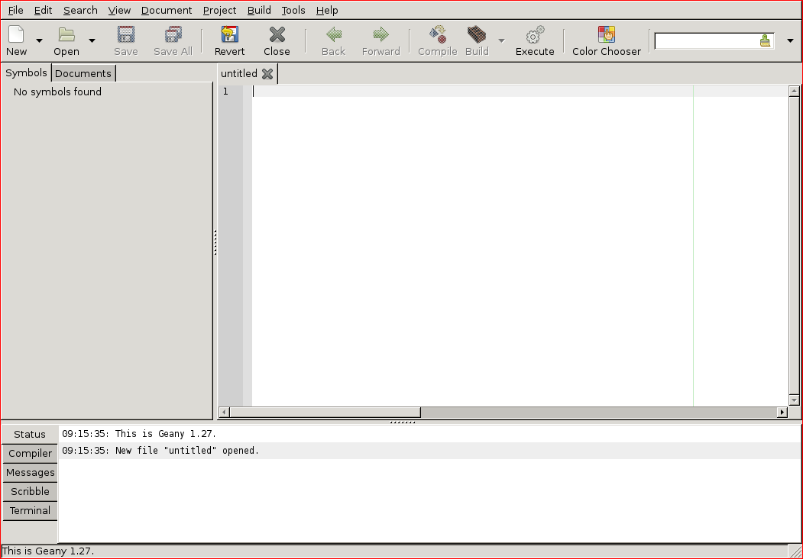
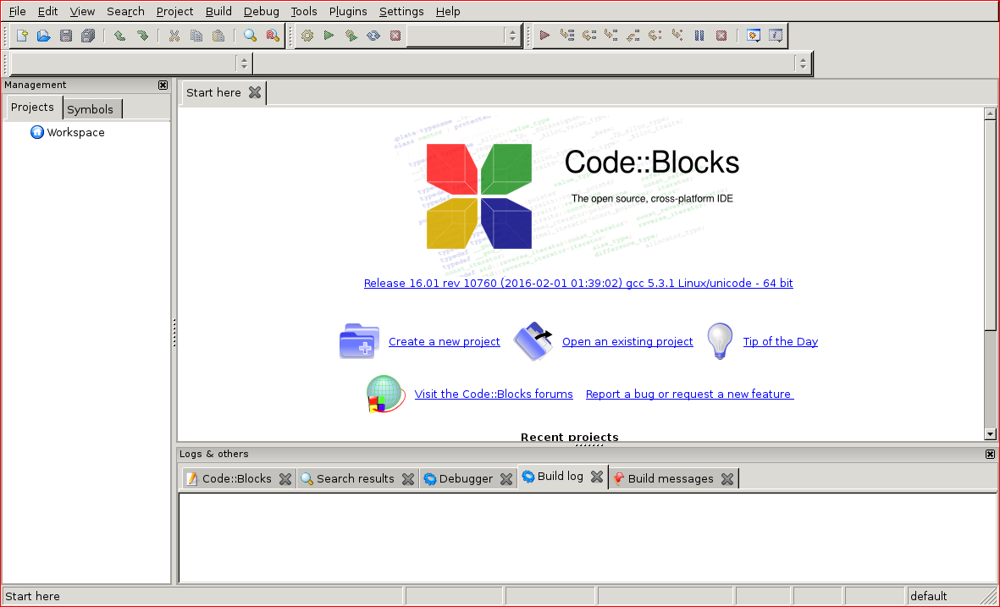

# Integrated Development Environments

## Motivation

Despite their modern appearance and ergonomic appeal, some people don't much care for console applications.
Truly, it is a mind-bending reality that some people would prefer to use a mouse to click *buttons* rather than typing commands in a shell.
What a world!

In our first lab, we tried a number of different text editors.
A couple of those (including Atom and Notepad++) included **graphical user interfaces** (GUIs).
This means you're free to use your mouse to select text, move text, scroll through text, choose menu action, click buttons, et cetera.
You don't have to do *everything* with keyboard shortcuts.

GUI text editors usually come with a lot of "batteries included".
However, there are still many more batteries available.

Consider how your programming process would change if you could:

- See syntax errors in your text editor.
- Compile and run your program with a single button click.
- Step through the execution of your program, line by line, to hunt down bugs.

These features are often present in **integrated development environments** (IDEs).
An IDE is GUI[^not-always-GUI] essentially a text-editor with a compiler and other development tools built in.
Everything you need is in one place.
There's no need to open a terminal to run `g++` or anything like that unless you really want to.

We know, we know.
You're *really* going to miss `g++`.

Just bear with us for this lab.
Then you can travel back to 1980 when things were actually good[^reagan].

### Takeaways

- Gain experience with Integrated Development Environments (IDEs)
    - Explore editor features
    - Try build (compilation) features
    - Experiment with built-in debugging tools

## Walkthrough

We're going to try out a couple of open source[^oss] IDEs that run on Linux.
Usually when we connect to a remote Linux machine, all we need is a shell, and PuTTY does everything we need.
For this lab, we're going to need to setup X-forwarding as well.
If you haven't already, be sure to reference the appendix on [X-forwarding].

Before lab, make sure you're able to start the two IDEs we will be using:

- Geany (`geany`) should look like Figure \ref{geany-startup}
- Code::Blocks (`codeblocks`) should look like Figure \ref{codeblocks-startup}

{ width=60% }

{ width=60% }

During your lab session, you'll be exploring some of the features of each of these IDEs.

\newpage
## Questions

1.  Click the "Build" drop-down menu in Geany. What are the sub-menu options?

    Note that we want to include the grayed-out options, too.
    Hint: there are seven of them.
\vspace{10em}

2.  Click the "Help" drop-down menu in Code::Blocks. What are the sub-menu options?

    Don't worry about sub-menus.
    Hint: there are three of them.
\vspace{10em}
\newpage

## Quick Reference

### General Tips

- Make sure you start Xming before you try to forward any X11 windows!
- You won't be able to use bash within the shell that's running `geany` or `codeblocks`.
  You may find it useful to keep a couple of PuTTY windows open while you work.

### Geany

#### Troubleshooting

- If geany complains that it’s unable to open its shell...
    1. Go to \menu{Edit > Preferences > Tools}
    2. Change Terminal from `x-terminal-emulator -e "/bin/sh %c"` to `xterm -e "/bin/sh %c"`
    3. Save your changes

#### Geany Features

- \keys{F9} Builds the project
- \keys{F5} Runs the project

#### Building with Geany

It doesn't work so well for multi-file projects.

After you create a project...

- Go to \menu{Project > Properties > Build}
- Find the "Build" command (`g++ -Wall -o "%e" "%f"`)
- Change it to `g++ -Wall -o "%e" *.cpp`

#### Writing code with Geany

- \keys{\ctrl + t} -- Go to function implementation
- \keys{\ctrl + space} -- Show completions.
- Set space preference to "Spaces" in \menu{Edit > Preferences > Editor > Indentation}
- You can auto-close brackets and parentheses as well.

### Code::Blocks

#### Troubleshooting

- Don't start Code::Blocks if your `pwd` is in your `SDRIVE`.
  Try changing to your linuxhome directory (i.e., `cd ~`).
  Otherwise you’ll be waiting *all day* for Code::Blocks to open up.
- If Code::Blocks doesn't let you navigate to your cloned repository, you can find it by going the long way.
  You can find your SDRIVE by going to its absolute path: `/nethome/users/<username>/cs1001/lab06/` (or whatever you call your repository.)

#### Building with Code::Blocks

- \keys{F9} -- Build and run
- \keys{\ctrl + F9} -- Build
- \keys{\ctrl + F10} -- Run
- Enable `-Wall` in \menu{Project > Build Options}

#### Writing code with Code::Blocks

- \keys{\ctrl + .} -- Go to function implementation.
- \keys{\ctrl + \shift + .} -- Go to function declaration.
- \keys{\ctrl + \SPACE} -- Show completions.
- Right-click on a file and choose ‘Format this file’ to autoformat.

## Further Reading

### Geany

- Geany Project Homepage: [http://www.geany.org/](http://www.geany.org/)
- Geany Plugins: [http://plugins.geany.org/downloads.html](http://plugins.geany.org/downloads.html)

### Code::Blocks

- Code::Blocks Project Homepage: [http://www.codeblocks.org](http://www.codeblocks.org)
- Tutorial from cplusplus.com: [http://www.cplusplus.com/doc/tutorial/introduction/codeblocks/](http://www.cplusplus.com/doc/tutorial/introduction/codeblocks/)

### Other IDEs

There are a bunch of other IDEs out there.
Some are free; some are not.
If you like the IDEa of an IDE, but you don't like Geany or Code::Blocks, you may give one of these guys a try.

- Visual Studio Code: [https://code.visualstudio.com/](https://code.visualstudio.com/)
- CLion: [https://www.jetbrains.com/clion/](https://www.jetbrains.com/clion/)

[^reagan]: Something something Ronald Reagan something something Breakfast Club something something.
[^not-always-GUI]: Depending who you ask, IDEs are not necessarily GUI programs. If you install enough plugins in vim or Emacs, some people would call those IDEs, as well.
[^oss]: Open source software (OSS) that is free as in freedom and free as in beer (or waffles if you prefer).
