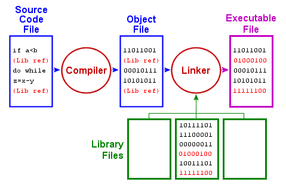

# Building with Make

## Motivation

Wow. You've made it six chapters through this book. And probably some appendices too. And yet you have made not one sandwich. Not one!

Let's fix that. Time for a classic pastrami on rye.
You go to fetch ingredients from the refrigerator, but alas! It is empty.
Someone else has been eating all your sandwiches while you were engrossed in regular expressions.

You hop on your velocipede[^bike] and pedal down to the local bodega only to discover that they, too, are out of sandwich fixin's.
Just as you feared -- you are left with no choice other than to derive a sandwich from first principles.

A day of cycling rewards you with the necessities: brisket, salt, vinegar, cucumbers, yeast, rye, wheat, caraway seeds, sugar, mustard seed, garlic cloves, red bell peppers, dill, and peppercorns.
Fortunately you didn't have to tow a cow home!
You set to work, pickling the beef and the cucumbers and setting the bell peppers out to dry.
Once the meat has cured, you crush the peppers, garlic, mustard seed, and peppercorns into a delicious dry rub and fire up the smoker.
Eight hours later and your hunk of pastrami is ready to be steamed until it's tender.

Meanwhile, you make a dough of the rye and wheat flours, caraway seeds, yeast, and a little sugar for the yeast to eat.
It rises by the smoker until it's ready to bake. You bake it with a shallow pan of water underneath so it forms a crisp outer crust.

Finally, you crush some mustard seed and mix in vinegar.
At last, your sandwich is ready. You spread your mustard on a slice of bread, heap on the pastrami, and garnish it with a fresh pickle.
Bon appétit!

In between bites of your sandwich, you wonder: "Wow, that was a lot of work for a sandwich.
And whenever I eat my way through what I've prepared, I'll have to do it all over again.
Isn't there a Better Way?"

A bite of crunchy pickle is accompanied by a revelation.
If the human brain is a computer, then this sandwich is code[^code]: without it, your brain could compute nothing![^torture]
"Wow!" you exclaim through a mouthful of pickle, "This is yet another problem solved by GNU Make!"

Using the powers of `git`, you travel into the future, read the rest of this chapter, then head off your past self before they pedal headfirst down the road of wasted time.[^time]
Instead of this hippie artisanal handcrafted sandwich garbage, you sit your past self down at their terminal and whisper savory nothings[^nothings] in their ear.
They -- you -- crack open a fresh editor and pen the pastrami of your dreams:

```makefile

pickles: cucumbers vinegar dill
	brine --with=dill cucumbers

cured-brisket: brisket vinegar
	brine brisket

paprika: red-peppers
	sun-dry red-peppers | grind > paprika

rub: paprika garlic mustard-seed peppercorns
	grind paprika garlic mustard-seed peppercorns > rub

smoked-brisket: cured-brisket rub
	season --with=rub cured-brisket -o seasoned-brisket
	smoke --time=8 hours seasoned-brisket

pastrami: smoked-brisket
	steam --until=tender smoked-brisket

dough: rye wheat coriander yeast sugar water
	mix --dry-first --yeast-separately rye wheat coriander yeast \
		sugar water --output=dough

rye-loaf: dough
	rise --location=beside-smoker dough && bake -t 20m

mustard: mustard-seed vinegar
	grind mustard-seed | mix vinegar > mustard

sandwich: pastrami pickles rye-loaf
	slice rye-loaf pastrami
	stack bread-slice --spread=mustard pastrami bread-slice
	present sandwich --garnish=pickle
```

Et voilà! You type `make sandwich`. Your computer's fans spin up. Text flies past on the screen.
A bird flies past the window. Distracted momentarily, you look away to contemplate the beauty of nature.
When you turn back, there on your keyboard is a delicious sandwich, accompanied by a pickle.
You quickly get a paper towel to mop up the pickle brine before it drips into your computer.
Should have used `plate`!

Since you've already read this chapter in the future, I should not need to mention the myriad non-culinary uses of `make`.
However, for the benefit of those who skipped the time-travel portion of the `git` chapter, I will anyway.
`make` is a program for making files from other files.
Perhaps its most common application is compiling large programming projects: rather than compiling every file each time you change something,
`make` can compile each file separately, and only recompile the files that have changed.
Overall, your compile times are shorter, and typing `make` is much easier than typing `g++ *.cpp -o neat-program`.
It has other uses, too: this book is built with `make`!

### Takeaways

- Learn to make a decent pastrami on rye
- Learn how to compile and link your C`++` code
- Understand `make`'s syntax for describing how files are built
- Use variables and patterns to shorten complex makefiles

## Walkthrough

### A bit about compiling and linking

Before we can set up a makefile for a C`++` project, we need to talk about compiling and linking code.
"Compiling" refers to the process of turning C`++` code into machine instructions.
Each `.cpp` file gets compiled separately, so if you use something defined in another file or library -- for example, `cin` --
the compiler leaves itself a note saying "later on when you figure out where `cin` is, put its address here".
Once your code is compiled, the linker then goes through all your compiled code and any libraries you have used and fills in all the notes
with the appropriate addresses.

You can separate these steps: `g++ -c file.cpp` just does the compilation step to `file.cpp` and produces a file named `file.o`.
This is a so-called *object file*; it consists of assembly code and cookies left out for the linker.[^milk]

To link a bunch of object files together, you call `g++` again[^confusing] like so: `g++ file1.o file2.o -o myprogram`.
`g++` notices that you have given it a bunch of object files, so instead of going through the compilation process,
it prepares a detailed list[^twice] explaining to the linker which files and libraries you used and how to combine them together.
It sets the list next to your object files[^milk2] and waits for the linker.
When the linker arrives, it paws through your object files, eats all the cookies,
and then through a terrifying process not entirely understood by humans[^exaggerating],
leaves you a beautiful executable wrapped up under your tree[^lovecraft].

<!-- copyright
{width=70%}
-->

So, what's the big deal?
Well, if you compile your code to object files and then change some of your code, you only need to rebuild the object files
associated with the code you changed!
All the other object files will stay the same.
If you have a big project with a lot of files, this can make recompiling your code significantly faster!
Of course, doing all this by hand would be awful...which is why we have `make`!

### Making Files

When you run `make`, it looks for a file named `Makefile` or `makefile` in the current directory for a recipe for building your code.
The contents of your `makefile` determine what gets made and how.

Most of what goes in a `makefile` are *targets*: the names of files you want to create.
Along with each target goes one or more commands that, when run, create the target file.

For example, let's say you want to build an executable named `program` by compiling all the C`++` files in the current directory.
You could do the following:

```makefile
program:
	g++ *.cpp -o program
```

Here, `program` is the target name. In a makefile, every target name is followed by a colon.
On the next line, indented one tab, is the command that, when run, produces a file named `program`.

**NOTE:** Unlike most programs, `make` *requires* that you use tabs, not spaces, to indent.[^tabs]
If you use spaces, you'll get a very strange error message. So make sure to set your editor to put actual tabs in your makefiles.

Once you've put this rule in your makefile, you can tell `make` to build `program` by running `make program`.[^execute]
You can also just run `make`; if you don't specify a target name, `make` will build the first target in your makefile.

Now, if you edit your code and run `make program` again, you'll notice a problem:

```
$ make program
make: 'program' is up to date.
```

Well, that's no good. `make` determines if it needs to re-build a target by looking at when the associated file was last modified and comparing that
with the modification times of the files the target depends on.
In this case, our `program` has no dependencies, so `make` doesn't think anything needs to happen!

Let's fix that. Since `make` is not omniscient[^yet], we need to explicitly state what each file depends on.
For our example, let's suppose we have a classic CS 1570 assignment with a `main.cpp` file, a `funcs.cpp` file, and an associated `funcs.h` header.
Whenever any one of these files change, we want to recompile `program`.
We specify these dependencies after the colon following the target name:

```makefile
program: main.cpp funcs.h funcs.cpp
	g++ *.cpp -o program
```

Now when we change those files and run `make`, it will re-build `program`!

This is all well and good, you say, but what about all those promises of sweet, sweet incremental compilation the previous section suggested?
Not to worry! You can tell `make` about each one of your targets and dependencies and it will do the work of running each compilation and linking step
as needed.
Continuing our example, we add two new targets for our object files, `main.o` and `funcs.o`:

```makefile
program: main.o funcs.o
	g++ main.o funcs.o -o program

main.o: main.cpp funcs.h
	g++ -c main.cpp

funcs.o: funcs.cpp funcs.h
	g++ -c funcs.cpp
```

Some things to notice in this example:

1. Our `program` target now depends not on our source files, but on `main.o` and `funcs.o`, which are themselves targets.
This is fine with `make`; when building `program` it will first look to see if `main.o` or `funcs.o` need to be built and build them if so,
then build `program`.
2. Each of our object file targets depends on `funcs.h`. This is because both `main.cpp` and `funcs.cpp` include `funcs.h`, so if the header changes,
both object files may need to be rebuilt.

File targets are the meat and potatoes[^tofu] of a healthy `make` breakfast.
Most of your makefiles will consist of describing the different files you want to build, which files those files are built from, and what commands need to be run
to build those files.
Later on in this chapter we'll discuss how to automate common patterns, like for the object files in the above example.
But now you know everything you need to get started using `make` to `make life-easier`![^pat]

### Phony Targets

Building files is great and all, but sometimes there are commands that you want to run often that you'd really rather not type out each time.
You *could* write a shell script, but you've already got a makefile; why not use that?
The most common example of this is commands to clean up all the files `make` generates in your current directory.
In this case, you don't want to generate any new files, and you don't want to lie to `make` because you're an honest upstanding citizen.

Fortunately, `make` supports this through something called *phony targets*.
You can tell `make`, "Hey, this target isn't actually a file; just run the commands listed here whenever I ask you to build this target,"
and `make` will be like, "Sure thing, boss! Look at me, not being confused at all about why there's no file named 'clean'!"

Let's make a `clean` target for our example from the last section.
Having a target named `clean` that gets rid of all the compiled files in your current directory is good `make` etiquette.

```makefile
program: main.o funcs.o
	g++ main.o funcs.o -o program

main.o: main.cpp funcs.h
	g++ -c main.cpp

funcs.o: funcs.cpp funcs.h
	g++ -c funcs.cpp

.PHONY: clean

clean:
	-@rm -f program
	-@rm -f *.o
```

Now when you run `make clean`, it will delete any object files, as well as your compiled program.[^anger]
There are a few pieces to this target:

1. There is a special target named `.PHONY`. Every target `.PHONY` depends on is a phony target that gets run every time you ask `make` to build it.
2. The `-` in front of a command tells `make` to ignore errors[^retval] from that command.
Normally when a program exits with an error, `make` bails out under the assumption that if that command failed, anything that depended on it probably won't work either.
Rather than trying anyway, it stops and lets you know what command failed so you can fix it.
In this case, we don't care if there isn't a file named `program` to delete; we just want to delete them if they exist.
3. The `@` in front of a command tells `make` to not print the command to the screen when `make` executes it.
We use it here so the output of `make clean` doesn't clutter up the screen.

### Variables

When writing more complex makefiles, you will want to use variables so that you can easily change targets in the future.
It is common to use variables to hold lists of files, compiler flags, and even programs!

Here's the syntax for variables:

- `var=value` sets `var` to `value.
- `${var}` or `$(var)` accesses the value of `var`.[^vars]
- The line `target: var=thing` sets the value of `var` to `thing` when building `target` and its dependencies.

For example, let's suppose we want to add some flags to `g++` in our example.
Furthermore, we want to have two sets of flags: one for a "release" build, and one for a "debug" build.
Using the "release" build will result in a fast and lean program, but compiling might take a while.
The "debug" build will compile faster and include debug information in our program.

We'll make a `CFLAGS` variable to hold the "release" flags and a `DEBUGFLAGS` variable to hold our "debug" flags.
That way, if we want to change our flags later on, we only need to look in one spot.
We'll also add a phony `debug` target so that running `make debug` builds our program in debug mode.

```makefile
CFLAGS = -O2
DEBUGFLAGS = -g -Wall -Wextra

program: main.o funcs.o
	g++ ${CFLAGS} main.o funcs.o -o program

.PHONY: debug clean
debug: CFLAGS=${DEBUGFLAGS}
debug: program

main.o: main.cpp funcs.h
	g++ ${CFLAGS} -c main.cpp

funcs.o: funcs.cpp funcs.h
	g++ ${CFLAGS} -c funcs.cpp

clean:
	-@ rm -f program *.o
```

Note that the `debug` target doesn't actually have any commands to run; it just changes the `CFLAGS` variable and then builds the `program` target.
(We'll talk about the `-g` flag in the next chapter. It's quite cool.)

As an aside, since `make` only tracks the modification times of files, when switching from doing a debug build to a release build or vice-versa,
you will want to run `make clean` first so that `make` will rebuild all your code with the appropriate compiler flags.

### Pattern Targets

You've probably noticed that our example so far has had an individual target for each object file.
If you had more files, adding all those targets would be a lot of work.
Instead of writing each of these out manually, `make` supports pattern targets that can save you a lot of work.

Before we set up a pattern target, we need some way to identify the files we want to compile.
`make` supports a wide variety of fancy variable assignment statements that are incredibly handy in combination with pattern targets.

You can store the files that match a glob expression using the `wildcard` function:
`cppfiles=$(wildcard *.cpp)`<!--* my markdown highlighter doesn't understand verbatim blocks so this shuts it up about italics-->
stores the name of every file ending in `.cpp` in a variable named `cppfiles`.

Once you have your list of C`++` files, you may want a list of their associated object files.
You can do pattern substitution on a list of filenames like so:
`objects=$(cppfiles:%.cpp=%.o)`.
This will turn your list of files ending in `.cpp` into a list of files ending in `.o` instead!

When writing a pattern rule, as with substitution, you use `%` for the variable part of the target name.
For example: `%.o: %.cpp` creates a target that builds a `.o` file from a matching `.cpp` file.

`make` has several special variables that you can use in any target, but are especially handy for pattern targets:

- `$@`: The name of the target.
- `$<`: The name of the first dependency.
- `$^`: The names of all the dependencies.

Let's rewrite our example using a pattern target to make the object files:

```makefile
SOURCES=$(wildcard *.cpp)
OBJECTS=$(SOURCES:%.cpp=%.o)
HEADERS=$(wildcard *.h)

program: ${OBJECTS}
	g++ $^ -o program

%.o: %.cpp ${HEADERS}
	g++ -c $<
```

Now our `program` target depends on all the object files which are calculated from the names of all the `.cpp` files in the current directory.
The target for each object file depends on the associated `.cpp` file as well as all the headers.[^headers]
With this pattern rule, you won't need to update your makefile if you add more files to your program later!

### Useful `make` Flags

`make` has a few flags that come in handy from time to time:

- `-j3` runs up to 3 jobs in parallel.[^cores]
- `-B` makes targets even if they seem up-to-date. Useful if you forget a dependency or don't want to run `make clean`!
- `-f <filename>` uses a different makefile other than one named `makefile` or `Makefile`.

\newpage
## Questions
Name: `______________________________`

Consider the following makefile:

```makefile
default: triangles

triangles: main.o TrianglePrinter.o funcs.o
	g++ $^ -o triangles

main.o: main.cpp TrianglePrinter.h funcs.h
	g++ -c main.cpp

TrianglePrinter.o: TrianglePrinter.cpp TrianglePrinter.h funcs.h
	g++ -c TrianglePrinter.cpp

funcs.o: funcs.cpp funcs.h
	g++ -c funcs.cpp
```

1. If you run `make`, what files get built?
\vspace{10em}

2. If you change `TrianglePrinter.h`, what targets will need to be rebuilt?
\newpage

## Quick Reference

## Further Reading

- [The GNU Make Manual](https://www.gnu.org/software/make/manual/html_node/index.html)
- [Special Variables](https://www.gnu.org/software/make/manual/html_node/Automatic-Variables.html#Automatic-Variables)

There are a couple of programs that can help generate makefiles for you:

- [`makedepend`](http://linux.die.net/man/1/makedepend) computes dependencies in C and C`++` code
- [`CMake`](https://cmake.org/) generates makefiles and various IDE project files

[^bike]: Velocipede (n): A bicycle for authors with access to a thesaurus.
[^code]: And your code is a sandwich: oodles of savory instructions sandwiched between the ELF header and your static variables.
[^torture]: The only thing more tortured than this analogy is the psychology 101 professors reading another term paper on how humans are just meat computers.
[^time]: Boy howdy do I wish this happened to me more often.
[^nothings]: Chaste tales of future sandwiches.
[^milk]: Good programmers always set a glass of milk out for the linker when compiling large programs.
[^confusing]: I agree that this is somewhat confusing, but trust me it is much much much less confusing than figuring out how to call `ld`, the actual linker tool, on your own.
[^twice]: And checks it twice.
[^milk2]: And the glass of milk, if you set one out for this purpose.
[^exaggerating]: I am not exaggerating here; linking executables is surprisingly full of arcane, system-dependent edge cases.
Fortunately some other poor soul (i.e., your compiler maintainer) has figured this out already and you should never need to worry about it.
[^lovecraft]: This Christmas chapter brought to you by H. P. Lovecraft.
[^tabs]: Stuart Feldman, the author of `make`, explains:

	> Why the tab in column 1? Yacc was new, Lex was brand new. I hadn't tried
> either, so I figured this would be a good excuse to learn. After getting myself
> snarled up with my first stab at Lex, I just did something simple with the
> pattern newline-tab. It worked, it stayed. And then a few weeks later I had a
> user population of about a dozen, most of them friends, and I didn't want to
> screw up my embedded base. The rest, sadly, is history.

	(From "Chapter 15. Tools: make: Automating Your Recipes", *The Art of Unix Programming*, Eric S. Raymond, 2003)
[^yet]: Not yet, at least.
[^pat]: At this point, have your past self pat you on the back. Good work!
[^anger]: The `clean` target is commonly used in anger when the dang compiler isn't working right and you're not sure why.
Maybe re-doing the whole process from scratch will fix things.
(It probably won't, but hey, it's worth a shot!)
[^retval]: In other words, a non-zero return value from that command.
[^headers]: This is because header files might be included in several places.
If you're interested in more accurately calculating dependencies, check out the `makedepend` program.
[^cores]: The general rule of thumb for the fastest builds is to use one more job than you have CPU cores.
This makes sure there's always a job ready to run even if some of them need to load files off the hard drive.
[^tofu]: Or tofu and potatoes, if that's your thing.
[^vars]: Be careful not to confuse this with `bash`'s `$()`, which executes whatever is between the parentheses.
[^execute]: Don't try to execute the makefile itself. `bash` is confused enough without trying to interpret `make`'s syntax!
