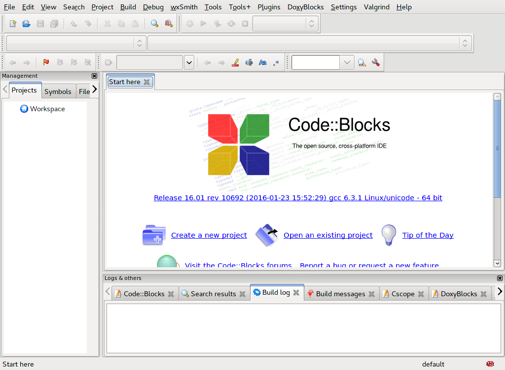
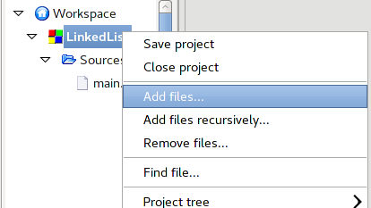
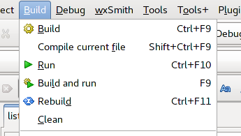
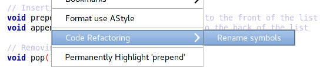
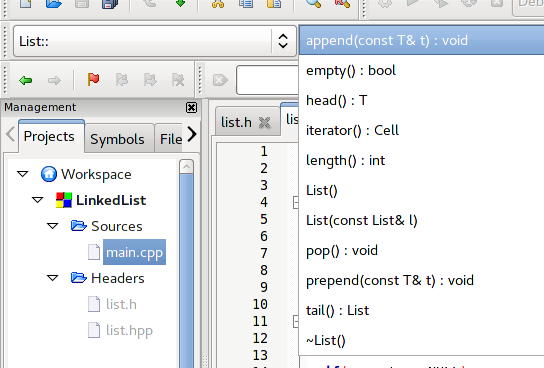
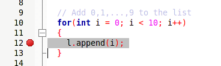

# Integrated Development Environments

## Motivation

Despite their modern appearance and ergonomic appeal, some people don't much care for console applications.
Truly, it is a mind-bending reality that some people would prefer to use a mouse to click *buttons* rather than typing commands in a shell.
What a world!

In our first lab, we tried a number of different text editors.
A couple of those (including Atom and Notepad++) included **graphical user interfaces** (GUIs).
This means you're free to use your mouse to select text, move text, scroll through text, choose menu action, click buttons, et cetera.
You don't have to do *everything* with keyboard shortcuts.

GUI text editors usually come with a lot of "batteries included".
However, there are still many more batteries available.

Consider how your programming process would change if you could:

- See syntax errors in your text editor.
- Compile and run your program with a single button click.
- Step through the execution of your program, line by line, to hunt down bugs.

These features are often present in **integrated development environments** (IDEs).
An IDE is GUI[^not-always-GUI] essentially a text-editor with a compiler and other development tools built in.
Everything you need is in one place.
There's no need to open a terminal to run `g++` or anything like that unless you really want to.

We know, we know.
You're *really* going to miss `g++`.

Just bear with us for this lab.
Then you can travel back to 1980 when things were actually good.[^reagan]

### Takeaways

- Explore editor features
- Try build (compilation) features
- Experiment with built-in debugging tools

## Walkthrough

Usually when we connect to a remote Linux machine, all we need is a shell, and PuTTY does everything we need.
For this lab, we're going to need to setup X-forwarding as well.
If you haven't already, be sure to reference the appendix on X-forwarding.
Make sure you start Xming before you try to forward any X11 windows!
You won't be able to use bash within the shell that's running `codeblocks`.
You may find it useful to keep a couple of PuTTY windows open while you work.

We'll be using the Code::Blocks IDE.
To open this IDE, run the `codeblocks` command in a shell.
Hopefully, after a while of thinking about it, the system will deign to display a window somewhat like the following:

Look! Buttons! Windows! Tabs!

### Getting started

Code::Blocks organizes your code into projects.
It's best to make one project per program.
Each project has an associated project file that ends in `.cbp`; this file keeps track of the code files in your project, how to build them, and various other
sundries.

To create a new project, click any of the numerous "new project" buttons.
Code::Blocks knows how to make a bunch of different kinds of software, but if you want to make a plain 'ol terminal application in C++, you'll want
to choose the "Console application" option:

{width=80%}

Code::Blocks will ask you for a name and a location to store the project in.
It will also ask you about compilers and targets --- the default values are fine; we'll talk about them later.

Once you've created a project, you can add new files to it via any of the "new" buttons.
Or, you may have some files that you'd like to add to your project --- maybe you have some starter code for an assignment,
or you're making a project for something you were already working on.
To do this, first put your files where you want them (usually in the project directory --- or you can make the project directory be the location of your files),
then right-click the project and click "Add files":

{width=50%}

### Building

Once you've created a project and put some files in it, you'll probably want to compile your code!
Below you can see the various compilation options Code::Blocks offers --- you can build your code and run it in one step!

{width=50%}

When you click "build", Code::Blocks only compiles the files that have changed since you last built the project.
Typically this works fine, but sometimes you'll want to recompile everything; for this task, the "rebuild" button is what you want.

Projects have one or more "build targets" --- by default, a "debug" target and a "release" target.
These targets primarily change the flags passed to the compiler; the debug target usually builds faster and includes debugging symbols,
but the code produced by the release target is more efficient.
If you are planning to use a debugger or Valgrind, you should use the "debug" target.

You can see your project's target configurations in the project build options (right-click on the project and choose "Build options").
For now, the options Code::Blocks chooses for you should be sufficient; later on in this book we'll discuss some additional flags that you might want to add.

<!-- {width=80%} -->

### Navigation and Editing

One big draw of using an IDE is the out-of-the-box editing and navigation features.
Since Code::Blocks is primarily designed for writing C++ programs, it offers special features for editing C++ code.

If you type a class instance name followed by a `.`, Code::Blocks will show a list of potential member functions and variables you may want:

{width=80%}

You can type the first few letters of the desired method or variable to narrow the list down,
then press \keys{\tab} to have Code::Blocks complete the name for you.

Once you've typed out a complete function name, Code::Blocks will show you the type signature, so you know what parameters it takes:

{width=80%}

You can also access the "Open Declaration" and "Open Implementation" features of the tab completion window by right-clicking on any function or variable name:

{width=70%}

In the same menu, under the "Code refactoring" submenu, you can rename a variable or function across all files in your project:

{width=80%}

If you are navigating through a large file, you can jump to function implementations with the "Code Completion" toolbar.
First, select the scope your function is declared in (typically either `<global>` or the name of the class your function is a member of):

Then select your function from the next drop-down, and Code::Blocks will jump you to that point in the file!

{width=80%}

You can collapse (or 'fold') code between braces by clicking the `-` button in the margin by the line number.
This is particularly handy when working with long functions that are hard to fit all on one screen.

{width=80%}

### Debugging

Code::Blocks integrates with the GNU debugger (`gdb`) to make debugging code easier for you.
We'll talk more about `gdb` in a future chapter, but for now we'll introduce the features Code::Blocks integrates with.

In short, a debugger allows you to pause the execution of your program, inspect variables, and step through your code line-by-line.
You can tell the debugger to stop execution at a specific line by setting a breakpoint on that line: click to the right of the line number,
and a little stop sign will appear:

{width=60%}

Once you've set one or more breakpoints, you can click the red arrow on the debugger toolbar to run your program and have it stop at that breakpoint.

{width=70%}

Other buttons on the toolbar allow you to step your code by line, or by CPU instruction.

When you are running a program in the debugger, you can right-click on variables and "watch" them---this will open a new window that displays that variable
and its value, along with function argument values and local variable values.
Once you're watching a variable, you can edit its value while the program is running!

{width=45%}

{width=35%}

Code::Blocks also opens a tab at the bottom of the window that allows you to send commands to `gdb`, just as you would when using `gdb` from the command line.
While Code::Blocks doesn't add any new functionality to `gdb`, it does make some common debugging tasks a lot easier!

{width=90%}

\newpage
## Questions
Name: `______________________________`

1. In your own words, list three features of an IDE.
\vspace{10em}

2. Think back to chapter 1. How do IDEs and text editors differ?
\newpage

## Quick Reference

### Troubleshooting

- Don't start Code::Blocks if your `pwd` is in your `SDRIVE`.
  Try changing to your linuxhome directory (i.e., `cd ~`).
  Otherwise you’ll be waiting *all day* for Code::Blocks to open up.
- If Code::Blocks doesn't let you navigate to your cloned repository, you can find it by going the long way.
  You can find your SDRIVE by going to its absolute path: `/nethome/users/<username>/cs1585/lab09/` (or whatever you call your repository.)

### Building with Code::Blocks

- \keys{F9} -- Build and run
- \keys{\ctrl + F9} -- Build
- \keys{\ctrl + F10} -- Run
- Enable `-Wall` in \menu{Project > Build Options}

### Writing code with Code::Blocks

- \keys{\ctrl + .} -- Go to function implementation.
- \keys{\ctrl + \shift + .} -- Go to function declaration.
- \keys{\ctrl + \SPACE} -- Show completions.
- Right-click on a file and choose ‘Format this file’ to autoformat.

## Further Reading

- Code::Blocks Project Homepage: [http://www.codeblocks.org](http://www.codeblocks.org)
- Tutorial from cplusplus.com: [http://www.cplusplus.com/doc/tutorial/introduction/codeblocks/](http://www.cplusplus.com/doc/tutorial/introduction/codeblocks/)

### Other IDEs

There are a bunch of other IDEs out there.
Some are free; some are not.
If you like the IDEa of an IDE, but you don't like Code::Blocks, you may give one of these guys a try.

- Visual Studio Code: [https://code.visualstudio.com/](https://code.visualstudio.com/)
- CLion: [https://www.jetbrains.com/clion/](https://www.jetbrains.com/clion/)

[^reagan]: Something something Ronald Reagan something something Breakfast Club something something.
[^not-always-GUI]: Depending who you ask, IDEs are not necessarily GUI programs. If you install enough plugins in vim or Emacs, some people would call those IDEs, as well.
[^oss]: Open source software (OSS) that is free as in freedom and free as in beer (or waffles if you prefer).
