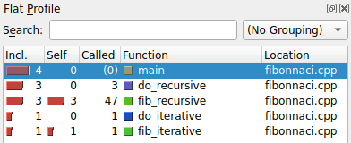
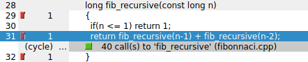
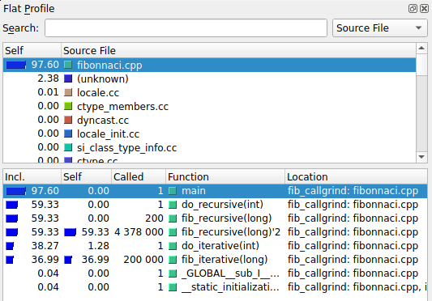
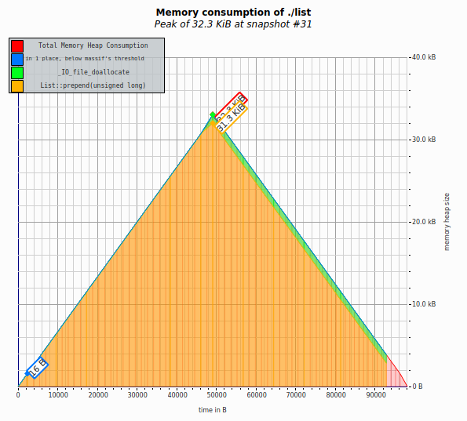
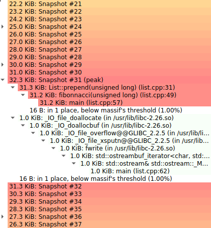
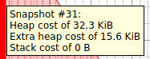
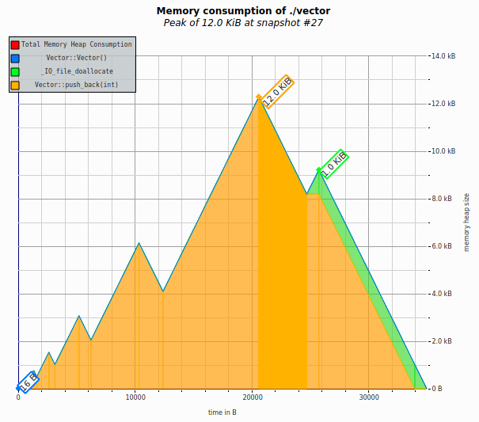
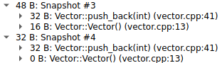

# Profiling

## Motivation

"IT'S NOT FAIR!"

You sit at your desk, bewildered.
If you'd known you'd have to deal with actors, you would have never taken this video editing job in 1960s Hollywood.

"I'm tellin' ya. *She* gets TWICE as much screen time as ME!"

Mr. Grampton St. Rumpterfrabble.
You know he's famous and you know people like him, but you never understood why.
Especially now.

"I really don't think that's true," you calmly reply as you push up your rose-colored glasses[^literal].
"I've already spliced the film together, and I don't think Ms. Stembleburgiss is seen anymore than you are."

"Yeah? Well prove it, wise guy."

You begrudgingly roll your chair over to your latest film invention: the Time-inator.
Carefully, you load the master reel for "The Duchess Approves II: The Duchess Doesn't Approve" into the input slot.
The machine whirs and clicks -- clacks and bonks.
Finally the 8-segment display at the bottom shows its output

~~~
idiots:      30m
film:        1h30m
projector:   5s
~~~

"Look," you motion to the display.
"This machine tells me how much of the movie features... actors..., how long the movie is, and how much time the projector spends warming up and stuff.
If you're going to be angry, be angry about the fact that you and Ms. Stembleburgiss are only on screen for 30 minutes.
As I recall, the film is mostly footage of Puddles the Amazing Schnauzer balancing on a beach ball."

"How *dare* you" St. Rumpterfrabble whispers with rage.
"Puddles earned every frame she is in."

A tear runs down his cheek.

"I cannot compete with that level of talent.
I *can* compete with HER, though."

"Ms. Stembleburgiss."

"Yes, Ms. Stumbleburger... Ms. Stepplemurder... Ms.... YOU KNOW WHO I MEAN.
I want you to go figure out **exactly** how much screen time *she* has and how much I have."

Realizing he's not going to leave until you do, you come up with a shortcut.
You load the master reel into your preview machine and check every 50th frame to see who's in the shot.
The film was shot at 24 frames per second, so you'll check about every 2 seconds of film.
It's not exact, but it's good enough.
Besides, the film is mostly Puddles anyway.

"You both share the same amount of screen time. Down to a granularity of 2-seconds," you blandly state.

"Two seconds?! That's enough to make or break a career!" St. Rumpterfrabble shouts.
"I want you to look at *every single frame* to see WHO has the most screen time!"

You slump onto your desk and consider going back for that degree in Computer Science.
Sure, Hollywood is grand, but at least you wouldn't be dealing with this sort of frame-by-frame tedium every day.

Well, you would, actually.

Everyone wants their programs to be fast, but it's not always obvious how to make them fast.
It is often necessary to dive *deep* to figure out where your program is spending most of its time running.
Just like watching your film frame-by-frame, sometimes you have to watch your program run line-by-line or instruction-by-instruction to figure out which parts are fast and which are slow.

Fortunately, you don't have to sit with your debugger counting line after line.
There are tools called **profilers** that automate this process for you.
You can think of them like souped-up stop watches.
They can give you detailed breakdowns of how your program spends its time, so that you can identify areas for improvement.

We'll talk about four (4)[^four] tools you have at your disposal for evaluating and analyzing your programs' performance.
`time` will tell you how much, uh, time your programs take to run overall.
`gprof` and `callgrind` give you a more detailed view of how long each part of your program takes to run.
Last, but not least, `massif` will tell you about how much memory your program uses!

### Takeaways

- Realize that films should feature more dogs balancing on beach balls
- Gain a basic understanding of what a profiler is and how different profilers work
- Understand how to use and interpret results from `time`, `gprof`, `callgrind`, and `massif`

## Walkthrough

### Timing Programs with `time`

You can think of `time` like a fancy stopwatch.
It tells you:

Real time

:   This is how long your program takes to run start to finish.
    We often call this "wall time" because you could measure the time elapsed using a clock on the wall.

User time

:   This is how long your program spends running on your computer's CPU.
    Your computer actually runs a lot of programs at once.
    There's a program that manages your monitor, one that handles keyboard input, one that manages your files, etc.
    The trouble is that if you have more programs than CPUs, they have to take turns.
    Your operating system will divide CPU time between the different programs.

    **User time** tells us how much time *your program* spends on the CPU.
    If it has to share the CPU with other programs (which it probably will), the user time will likely be much less than the real time.

System time

:   This is how long your program spends waiting to hear back from your operating system (OS).
    Whenever you do any sort of I/O[^io] operations, your program makes a system call that asks your OS to do those things for you.
    If your OS is busy doing other stuff, your program will have to wait to hear back from the OS before it can continue running.
    **System time** reflects this time spent waiting to hear back from the OS.

`time` is very easy to use.
In order to use it, just throw `time` in front of the program you want to run.
It doesn't care if the program has command line arguments.

If we want to see how long it takes to list the files in /tmp:

~~~shell
$ time ls /tmp
time ls -a /tmp
.    ..

real    0m0.004s
user    0m0.001s
sys     0m0.002s
~~~

If we wanted to time a hello world program:

~~~shell
$ g++ -o hello hello.cpp
$ time ./hello
~~~

Program execution time (especially real/wall clock time) can fluctuate for a variety of reasons.
If you just want to see how long it takes your program to run, this is fine.
However, if you want to compare the runtime of two programs --- say you make a change to your code and want to see
if it sped up the program's execution or not --- you should measure its execution time a few times and average them.[^stats]

### Profiling with `gperftool`

Although `time` is handy for determining run times, it doesn't give you any indication about which parts of your programs are slow and which parts are fast.
However, `gperftool` can do that for you.
`gperftool` samples your program (by default, 100 times per second) as it runs to tell you how much time you're spending in function calls.
We'll use `kcachegrind` to display `gperftool`'s output in a GUI and discuss what its results mean.

First, let's look at an example program.
In this program, we have a few different functions:
- Two different methods for computing the $n^{th}$ Fibonnaci number (`fib_iterative` and `fib_recursive`)
- Two functions that repeatedly compute the $20^{th}$ Fibonnaci number (`do_iterative` and `do_recursive`)
- `main`, which calls `fib_iterative` 200,000 times and `fib_recursive` 200 times

~~~{.cpp .numberLines}
#include <iostream>
using namespace std;

long fib_iterative(const long n)
{
  long fib = 1;
  long prev_fib = 0;

  for(long i = 0; i < n; i++)
  {
    long tmp = fib;
    fib += prev_fib;
    prev_fib = tmp;
  }

  return fib;
}

void do_iterative(const int count)
{
  volatile long fib;
  cout << "Iterative: ";
  for(int i = 0; i < count; i++)
    fib = fib_iterative(20);
  cout << fib << endl;
}

long fib_recursive(const long n)
{
  if(n <= 1) return 1;
  return fib_recursive(n-1) + fib_recursive(n-2);
}

void do_recursive(const int count)
{
  volatile long fib;
  cout << "Recursive: ";
  for(int i = 0; i < count; i++)
    fib = fib_recursive(20);
  cout << fib << endl;
}

int main()
{
  const int count = 200;

  do_iterative(count * 1000);

  do_recursive(count);
  return 0;
}
~~~

In order to use `gperftool`, we have to link its library with our code using the `-lprofiler` flag.
We'll also want to use the `-g` flag so that `kcachegrind` can show us our source code when we're viewing our profiling output!

Let's compile the program above.
We'll assume it's called `fibonnaci.cpp`.

~~~shell
$ ls
fibonnaci.cpp
$ g++ -g -lprofiler -o  fibonnaci.cpp
$ ls
fibonnaci    fibonnaci.cpp
~~~

By default, `gperftool` doesn't do anything when you execute your program.
To get it to profile your code, you will need to set an environment variable, `CPUPROFILE`, to the name of the file where you want to store your profile output.
We'll store ours in a file named `gperftool.prof`:

~~~shell
$ CPUPROFILE=gperftool.prof ./fibonnaci
Iterative: 10946
Recursive: 10946
PROFILE: interrupts/evictions/bytes = 4/0/608
$ ls
fibonnaci    fibonnaci.cpp    gperftool.prof
~~~

Now that we have `gperftool.prof`, we will use a program called `pprof` to turn this data into something `kcachegrind` can understand.
`pprof` needs to know both the executable you ran (`./fibonnaci`) and the file holding `gperftool`'s profile output (`gperftool.prof`).
We'll store this in a file named `gperftool.out`:

~~~shell
$ pprof --callgrind ./fibonnaci gperftool.prof > gperftool.out
~~~

Last but not least, open `gperftool.out` in `kcachegrind`:[^X11-dont-forget]

~~~shell
$ kcachegrind gperftool.out
~~~

To review, to use `gperftool`, you need to do the following:

1. Link the profiler library into your program with `-lprofiler` and enable debug information with `-g`
2. Run your program with the `CPUPROFILE` environment variable set to the name of the profiler output file
3. Use `pprof` to convert the profiler output file into a format `kcachegrind` understands
4. Use `kcachegrind` to visualize your output!

### Using `kcachegrind` to Interpret `gperftool` Statistics

When you open `kcachegrind`, you will see three panes.
On the left is the **flat profile**, which shows a list of functions and statistics about them.
On the bottom right is the **call graph** --- a directed graph showing what functions each function calls.

On the top right is the **source code viewer**, which displays the source code for the currently selected function.
Click on a function in the flat profile or call graph to change what code displays in the viewer.

Across the top is a toolbar; of note are the **Relative** and **Shorten Templates** options.
Relative converts counts to percentages; this is handy when working with large numbers
that are hard to compare visually.
Shorten Templates is useful when working with code that uses lots of templates.
We'll see it used later on in the chapter.

#### The Flat Profile

The flat profile for our Fibonnaci function should look something like this:

{width=80%}

The **Function** and **Location** columns indicate the function name and the file wherein
the function was declared.
Hopefully those are pretty straightforward...now for the remainder!

First, the **Self** column.
This is the number of times this function was executing when `gperftool` took a snapshot of your program's execution.
Here we can see that we took 4 snapshots; in 3 of them, `fib_recursive` was running.

The **Incl.** ('Inclusive') column shows the number of times this function or a function it called was executing
at the time of a snapshot.
Naturally, a function called by `main` was executing in each of the 4 samples.
Likewise, `do_recursive` calls `fib_recursive`, so it shows up in 3 of the samples.

Finally, the **Called** column indicates the number of times this function appears in a backtrace across all samples.
(`main` is a special case --- **called** is meant to measure the number of times a function is called; as far as we are concerned,
 `main` "spontaneously" begins executing, so it has a called count of 0.)
Usually this is the same as **Incl.** except in the case where the function is recursive. <!-- TODO is this correct? -->

So, in our example, `do_recursive` appears a total of 3 times in the backtraces taken at each sample.
(Recall, though, that we only called `do_recursive` once; **called** is a best guess at the call count, not an exact measure.)
This is all well and good.
However, `fib_recursive` appears a total of 47 times! How does this work?

Let's make an example backtrace that `gperftool` would see when taking a snapshot.
We'll write it the way `gdb` would display it:

~~~
#1 fib_recursive(n=17)
#2 fib_recursive(n=18)
#3 fib_recursive(n=19)
#4 fib_recursive(n=20)
#5 do_recursive(count=200)
#6 main()
~~~

For this snapshot, `gperftool` would add 1 to the **called** count for `do_recursive`, but 4 to the **called** count for `fib_recursive`.

If you've got a slow program, looking at the **Incl.** column will tell you where it's spending most of its time.
You can then look into how those "expensive" functions are implemented and see if you can speed them (or a function they call) up.
The **Called** column will also show you at a glance whether you've got some out-of-control recursion going on!

The columns shown contain the following information:

- `% time`: The percentage of execution time spent in that function. This column should sum to 100%.
- `cumulative seconds`: The execution time spent in this function and all functions above it in the table.
- `self seconds`: The execution time spent in this function.
- `calls`: The number of times this function was called.
- `self s/call`: The average execution time spent per call. This is calculated by `self seconds`/`calls`.
- `total s/call`: The average execution time spent per call of this function and all its descendants (functions it calls).

#### The Call Graph

In addition to the Flat Profile, `kcachegrind` shows you a Call Graph.
The Call Graph goes one step further than the Flat Profile by showing you how much time you spent running a function and its children.

{width=80%}

The Call Graph provides information relative to the currently selected function in the Flat Profile.

- Each function box is annotated with the number of measurements where it, or one of its children, was executing when the selected function was executing.
    Thus, `main()` was executing in all four measurements and `do_iterative()` was executing in one of the four measurements where `main()` was executing.
- Each arrow is annotated with the number of times the parent function called the child function while the selected function was executing.
    Thus, `do_recursive()` called `fib_recursive()` three times, and `fib_recursive()` called itself forty times across all measurements.

Double-clicking on a function in the Call Graph or selecting it in the Flat Profile changes the perspective of the call graph.
Functions are only shown if they called or were called by the selected function.
This can help you narrow down an unwieldy call graph to show just the information relevant to the function you're interested in.

{width=40%}

Above the call graph is a set of tabs; of interest to us is the one marked **Source Code**.
Since we've compiled with the `-g` flag, `gperftool` is able to annotate where each function was executing when it took its sample.

{width=80%}

Here we see that `fib_recursive` was executing line 29 in one sample, line 31 in another, and line 32 in a third.
(Lines 29 and 32 "executing" indicates that the function was in the process of setting itself up or cleaning up before returning.)
We can also see that line 31 generated 40 calls to `fib_recursive`.

Now, this is all well and good, you say, but c'mon! We're calling these functions thousands of times and all we get are four lousy samples?

You can increase the sampling rate by setting the `CPUPROFILE_FREQUENCY` environment variable to the number of times per second it should take a measurement.
So, to sample 1000 times a second, you could do the following:

```
$ CPUPROFILE=gperftool.prof CPUPROFILE_FREQUENCY=1000 ./fibonnaci
```

This, of course, still won't be exactly right, but it'll provide more detail and more accurate counts.

You step out of your chair, take three menacing steps towards me, and begin pounding both your fists on the fourth wall.[^remember-movie]
"What good is a computer if it can't produce exact counts?"

You pound your fists again, harder.

"GIVE ME THE EXACT CALL COUNTS!"

Okay, buddy, relax, it's alright, we can do that. Just sit down and keep reading the book, okay?

### Profiling with `callgrind`

`gperftool`'s approach to take 100 samples every second works for many people when they're trying to identify slow spots in their code.
However, it is not perfect.

Remember our film predicament?
`gperftool` is like looking at every 50th frame (checking every two seconds of film).
It gives you a *good* idea of how much movie time we spend looking at Mr. St. Rumpterfrabble, but it's not perfect.
If we take the time to go frame-by-frame, that's the most detailed we can possibly get.

`callgrind` is our frame-by-frame approach.
Instead of going fame-by-frame,[^movie] we're going instruction-by-instruction.
`callgrind` is one of several tools built using the Valgrind framework.
Tools built using Valgrind can see *every single instruction* that is run by a program.
This level of detail can be very powerful, but it can also be pretty slow.

Let's consider our program from the `gperftool` section.
This time when we compile it, we just need to pass the `-g` flag; no need for `-lprofiler`!
Then we'll run our program through `callgrind` as shown.

~~~shell
$ g++ -g -o fibonnaci fibonnaci.cpp
$ valgrind --tool=callgrind ./fibonnaci
~~~

Like `gperftool`, callgrind will generate a data file for us.
The output file does not always have the same name; each `callgrind.out.NNNN` file is named according to its process ID.
When we use `kcachegrind` to view the profile information, we need to make sure we pass the right `callgrind.out.NNNN`.
Unlike `gperftool`, `callgrind` outputs a file that `kcachegrind` can read.

~~~shell
$ ls
callgrind.out.2653    fibonnaci    fibonnaci.cpp
$ kcachegrind callgrind.out.2653
~~~

The first thing you'll notice is that there are a lot more things in the flat profile!
Callgrind truly does monitor *everything*.
Fortunately, there is a way to display only relevant information.
In the top right-hand corner of the flat profile, there is a drop-down which should read `(No Grouping)` right now.
Here you can group by "ELF object" --- the executable or library where the function is stored, source file, or C++ class.

We'll group by source file.
A second listing will appear, allowing you to choose which functions should be displayed based on the file they're defined in.
Make sure `fibonnaci.cpp` is selected in the list.

Also, we'll switch to Relative counts (using the button on the toolbar at the top of the window) since the instruction counts are quite large.

{width=80%}

You may have noticed that the entries in the **Called** column match exactly what we'd expect from the program!
Each of `do_iterative` and `do_recursive` are called once, and `fib_iterative` is called 200,000 times.
`fib_recursive` has two entries: `fib_recursive` and `fib_recursive'2`.
The first entry counts the number of calls from another function to `fib_recursive`, and the second counts the number of calls from `fib_recursive` to itself.
We can see that 200 calls to `fib_recursive` generates over 4 million recursive steps!

Furthermore, we can see that about 60% of the execution time was spent in `do_recursive` and its children and the remaining 40% in `do_iterative` and its children.

The call graph reads the same as it does for `gperftool`, except the call counts along each edge are exact!

Callgrind measures the number of CPU instructions executed by each line of code.
We can see these counts in the Source Code view!
First, we'll want to switch from relative back to absolute counts.
Then, let's select `do_recursive` in the Flat Profile and examine its source code.


Let's break this down a bit:

- We spend 4 instructions setting up the function --- allocating memory for variables &c.
- We spend 4 instructions printing "Recursive: " to the screen.
    However, those 4 instructions really just measure the instructions it takes to call `operator<<`; that call takes a total of 305 instructions.
    So overall we spend 309 instructions printing out that line.
- A total of 1004 instructions are spent on the `for` loop itself.
- Inside the `for` loop, we spend 600 instructions (3 per iteration) setting up the call to `fib_recursive`
    and 74 million instructions actually computing Fibonnaci numbers.

As you can see, `callgrind` gives us different details that `gprof` cannot.
Based on where you run the most instructions, you can identify parts of your code that may need to be rewritten.

### Profiling memory usage with `massif`

The tools we've seen so far (`time`, `gprof`, and `callgrind`) are all concerned with the speed of our program.
They help us figure out how we're spending our time as we run our programs.
However, there are profilers that are concerned with resources other than time.

`massif`, for example, is another profiling tool built with Valgrind.
Instead of looking at program timing, `massif` looks at memory usage.
The information that it gives you can be useful for identifying code that hogs memory unnecessarily.

Since we're talking about memory, let's use two memory-oriented examples.
We'll have one program, `list.cpp`, which uses a linked list to store Fibonnaci numbers during computation.
Here's the implementation, minus the linked list:

~~~ {.cpp .numberLines startFrom=41}
List* fibonnacci(unsigned long n)
{
  List* fib = new List(1);

  fib = fib->prepend(1);

  for(unsigned long i = 2; i <= n; i++)
  {
    fib = fib->prepend(fib->number() + fib->next()->number());
  }

  return fib;
}

int main()
{
  List* fib = fibonnacci(2000);
  List* iterator = fib;

  while(iterator != NULL)
  {
    cout << iterator->number() << endl;
    iterator = iterator->next();
  }

  delete fib;
  return 0;
}
~~~

The other program, `vector.cpp`, does the same thing, but with a vector instead:

~~~ {.cpp .numberLines startFrom=72}
Vector fibonnaci(unsigned long n)
{
  Vector fib;

  fib.push_back(1);
  fib.push_back(1);

  for(unsigned long i = 2; i <= n; i++)
  {
    fib.push_back(fib[i-1] + fib[i-2]);
  }

  return fib;
}

int main()
{
  Vector fib = fibonnaci(2000);

  for(int i = 0; i < 2000; i++)
  {
    cout << fib[i] << endl;
  }
}
~~~

When we compile this program, we'll need to use the same flags that we used when compiling for `callgrind`.
Then we can run the compiled program through `massif`.
It's worth mentioning that `massif`, by default, is only concerned about watching memory on the heap.
If you need to see information about the stack, you can use the `--stack=yes` flag.

Also, `massif` uses seconds as its unit of time by default.
While this makes sense, our program is *very* fast.
Every single one of our allocations happens within one millisecond.
That means that even if we use milliseconds as our `--time-unit`, all of the allocations happen (apparently) at the same time.
If we use bytes as our time unit, the amount of memory allocated is a function of our memory operations (allocations and deallocations).
This makes our plot look a lot saner.
To do so, we'll pass `--time-unit=B` to `massif`.

~~~
$ g++ -g -o list list.cpp
$ valgrind --tool=massif --time-unit=B ./list
~~~

**Note:** For much of this book, we have gently steered you around dealing with C++ library innards.
Sure, they might have shown up in a stack trace or profiling list, but for the most part we could just ignore them
and go about our business without paying them any mind.
Unfortunately, if we attempt the same with `massif`, the output we get will likely be ridiculously uninformative!
If you see a big (about 75 KB) allocation coming from some file in `/usr/lib` in your output, you'll need to tell `massif` to ignore it.
To do so, pick out the first function name that isn't `???` in the call stack for that big allocation; for you, it may be something like `_GLOBAL__sub_I_eh_alloc.cc`
or `call_init.part.0`.
For this example, we'll use `call_init.part.0`.
You'll pass that in *two* flags to `massif`: `--alloc-fn` and `--ignore-fn`.
(The first tells `massif` to treat that function like a memory allocation function; the second tells it to ignore allocations from that function.)
So, you'd end up running the following command, instead of the one above:

~~~
$ valgrind --tool=massif --time-unit=B --alloc-fn='call_init.part.0' --ignore-fn='call_init.part.0' ./list
~~~

Such is life. Remember, you have shell scripts and makefiles at your disposal! Use those to keep from having to type such an egregious command over and over.

Like `callgrind`, we'll get a numbered output file with a name like `massif.out.NNNN` (where `NNNN` is the process ID).

~~~
$ ls
list.cpp    list    massif.out.5029    vector.cpp
~~~

We'll visualize this using the `massif-visualizer` tool:

~~~
$ massif-visualizer massif.out.5029
~~~

#### Reading the Memory Graph

Let's have a look at the memory allocation graph for the list example.

{width=80%}

The X-axis is time, in this case measured in total bytes allocated/deallocated.

The Y-axis is the amount of memory that your program has allocated on the heap at a given time.
As you can see, our program allocates more and more memory until it reaches its peak at 32.3 KB.
After that, we deallocate memory, one list node at a time.

This plot contains two kinds of graph: the Total Cost Graph and the Detailed Cost Graphs.
The display of these graphs can be toggled via buttons on the toolbar.
The total cost graph shows the total memory consumption of your program.
The detailed cost graphs break the memory consumption down based on where the memory was allocated.
Hover your mouse cursor over different parts of the graph to see details.

In this graph we can see two places where our program allocated memory.
Most of it is allocated by the linked list.
Since linked lists allocate and free memory one node at a time, our allocation graph looks like a pyramid.
The second portion (in green) is in `_IO_file_doallocate`.
This is the output buffer for `cout`!

#### Reading the Snapshot Table

The memory graph is handy for getting a quick idea of how memory is allocated by your program.
To give you more information about the memory snapshots, `massif-visualizer` includes details in a table next to the graph.

{width=60%}

Snapshots are colored from green to red, with the reddest being the snapshot taken at peak memory usage.
Most snapshots just record total memory usage and are plotted by the total cost graph.
About every 10 snapshots, a detailed snapshot is taken which records which functions are responsible for the various memory allocations.
These details are plotted in the detailed cost graphs.

Once we reach the peak (snapshot #31), we can see that the time (in bytes) continues to increase, but the total starts to go down.
With each deallocation of `N` bytes, the total will decrease by `N` bytes, but the time will increase by `N` bytes.

At the peak memory allocation, we can see that:

- 31.2 KB of our memory has been allocated by the call to `prepend` on line 49 of `list.cpp`.
- There's one other allocation caused by `prepend`; examining the source code, we see that happens on line 45.
- 1 KB of memory is allocated by our call to `operator<<` on line 62 of main, where we print out the entries in the list.
- One other 16 byte allocation has happened; this corresponds to the call to the `List` constructor on line 43.

Looking at the last snapshot, we can see that all of our heap memory has been deallocated [^yay]!
From the X axis, we can see that we've allocated and deallocated a total of about 98 KB.
In other words, if we summed the memory that we `new`'d and `delete`'d we would have 98 KB.

You may notice that our peak allocation of 32.3 KB happens right around 49 KB, even though we haven't freed any memory before this point.
What gives?
Well, memory allocations aren't free --- every call to `new` requires some bookkeeping on the behalf of the operating system so it knows that
that block of memory is allocated.
`massif` tracks this as "extra heap cost"; you can see this cost if you hover your cursor over the appropriate entry in the cost graph.

{width=30%}

We can see we have a heap cost of 32.3 KB plus administrative overhead of 15.6 KB, which adds up to a total heap usage of 47.8 KB!

#### Comparing `List` and `Vector` results

Now that we've got an idea of what `massif` can show us, let's look at how our vector solution differs from our list solution.
If we just run `massif` as before, we'll see that the total cost graph looks jagged, but the detailed cost graphs form a nice pyramid.
Even worse, sometimes the detailed cost graphs say the memory use is higher than the total cost graph!
How can this be?
Well, recall that the detailed graphs are built just from the detailed snapshots, so the total cost graph contains far more data points than the detailed ones.
To get a more accurate detailed cost graph, we can increase the number of detailed snapshots taken.

Let's run `massif` on our vector example, but pass it `--detailed-freq=1` in addition to our other flags.
This will make every snapshot a detailed snapshot.

{width=80%}

Instead of being a smooth pyramid, it's jagged. To see why, let's look at snapshots 3 and 4, where the first dip occurs:

{width=60%}

We can see that in snapshot 3, we've allocated 16 bytes in `Vector`'s constructor and 32 in `push_back`.
Snapshot 4 is taken when the memory allocated in the constructor is freed.
In other words, these two snapshots happen when the vector resizes: a new array is allocated that's twice as large as the existing one,
all the data is copied over, then the old array is freed.
Most of the sawtooths in the cost graph correspond to the vector resizing!

Also, let's consider that both our vector and list store the same amount of data (2000 entries),
but while our list consumed 32 KB, our vector consumes 12 KB at most (and that during a resize)!
This stark difference in memory consumption is because each list node must store both a number and a pointer, whereas
the vector just stores an array of numbers.
Furthermore, while our list had 15.6 KB of heap overhead, our vector has at most 16 bytes because it has, at most, two blocks of heap memory allocated.
The list, on the other hand, has 2000 blocks allocated at its peak!

Hopefully this comparison highlights some of the interesting things `massif` can show you about how programs use memory.

\newpage
## Questions

Name: `______________________________`

1. Use `time` to time the execution of a simple Hello World program. What were the values for `real`, `user`, and `sys`? Explain what each of these values means.
\vspace{8em}

2. Briefly explain, in your own words, the difference between the way `gperftool` and `callgrind` profile programs.
\vspace{8em}

3. Briefly summarize the output you get when you use `time`, `gperftool`, and `callgrind` to profile a program.
\vspace{8em}

4. Briefly explain, in your own words, why we would use bytes as our unit of time in `massif` instead of seconds (or milliseconds).
\vspace{8em}

\newpage

## Quick Reference

### `time`

-   Just run `time <program> [<args...>]`!
-   Reading `time`'s output:
    -   **Real**: The wall-clock or total time the program took to run.
    -   **User**: The time the program (and libraries) spent executing
        CPU instructions.
    -   **System**: The time the program spent waiting on system calls
        (usually I/O).

### `gprof`

-   First, You must compile with the `-pg` flag.
-   Then, run your program like normal. It will create a file named `gmon.out`.
-   `gprof <program>` reads `gmon.out` generated by `<program>` and displays profiling statistics!

#### Flat Profiles

-   A **flat profile** is an overview of function usage.
-   Time measures are based on sampling 100 times/second.
-   Function call counts are exact.

#### Call Graphs

-   A **call graph** is a listing of which functions called each other.
-   The line with the index entry is the function under consideration.
-   Lines above that are functions that called this function.
-   Lines below that are functions that this function called.

### `callgrind`

-   Compile with the `-g` flag.
-   Running callgrind will create a file named `callgrind.out.NNNN`.
    -   `valgrind --tool=callgrind ./program`
-   The `callgrind_annotate` tool reads `callgrind.out` files and prints some statistics on your program.
    -   `callgrind_annotate --auto=yes callgrind.out.NNNN`
-   Callgrind counts instructions executed, not time spent.
-   The annotated source shows the number of instruction executions a specific line caused.
-   Function calls are annotated on the right with the number of times they are called.

#### Recursion and callgrind

-   Recursion can confuse both `gprof` and `callgrind`.
-   The `--separate-recs=N` option to Valgrind separates function calls up to `N` deep.
-   The `--separate-callers=N` option to Valgrind separates functions depending on which function called them.
-   In general, when you have recursion, the call graph and call counts may be wrong, but the instruction count will be correct.

### `massif`

-   Compile with the `-g` flag
-   Running `massif` will create a file named `massif.out.NNNN`.
    -   `valgrind --tool=massif --time-unit=B ./program`
-   To get information on stack memory usage as well, include `--stack=yes` after `--time-unit=B`.
-   The `ms_print` tool reads `massif.out` files and prints statistics for you.
    - `ms_print massif.out.NNNN`
-   Snapshots: `massif` takes a snapshot of the heap on every allocation
    and deallocation.
    -   Most snapshots are **plain**. They record only how much heap was allocated.
    -   Every 10th snapshot is **detailed**. These record where memory was allocated in the program.
    -   A detailed snapshot is also taken at peak memory usage.
-   The graph: Memory allocated vs. time. Time can be measured in milliseconds, instructions, or bytes allocated.
    -   Colons (`:`) indicate plain snapshots, at-signs (`@`) indicate detailed snapshots, and pound-signs (`#`) indicate the peak snapshot.
-   The table shows the snapshot number, time, total memory allocated, currently-allocated memory, and extra allocated memory.
-   The table also shows the allocation tree from each detailed snapshot.

## Further Reading

### `gprof`

- [Interpreting Flat Profiles](https://sourceware.org/binutils/docs/gprof/Flat-Profile.html#Flat-Profile)
- [Interpreting Call Graphs](https://sourceware.org/binutils/docs/gprof/Call-Graph.html#Call-Graph)

### `callgrind`

- [Callgrind's Manual](http://valgrind.org/docs/manual/cl-manual.html)

### `massif`

- [Massif's Manual](http://valgrind.org/docs/manual/ms-manual.html)


[^literal]: They're literally glasses with rose-colored lenses. It's not a metaphor or any such nonsense.
[^io]: Input/Output
[^movie]: Since we're talking about programs... not movies.
[^yay]: Yay!
[^four]: 4 (four)
[^stats]: Or if you really feel like being pedantic, you can throw a litany of statistical tests at it instead...
but you probably only care about that if you're trying to do science.
[^X11-dont-forget]: Don't forget to turn on X-forwarding if you haven't already!
[^remember-movie]: We're doing a movie metaphor this chapter, remember?

<!--  LocalWords:  profiler profilers gprof callgrind Rumpterfrabble
 -->
