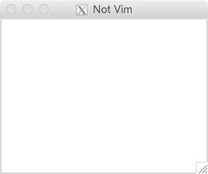

# Graphical User Interfaces with Qt
<!--
TODO
- screenshots
- fill out quick reference
-->
## Motivation

Close your eyes.

Wait, no. Open them! Look around you!

Unless you're a 1337 cyber hacker, you probably don't see just text in terminals.
If you do, you should really see a doctor about that.

Ok, this next part might be a little weird, but trust us, it's necessary for your understanding.
You may feel some slight discomfort as you read the next bit:

\begin{figure}
\centering
\includegraphics[width=0.5\textwidth]{12/zalgo.png}
\end{figure}

You lift your hands to sip your coffee, but instead of hands, you see a large mouse cursor.
Disturbed but undeterred (coffee is important, after all), you move your cursor towards your mug, but you pause once the cursor is on the mug.
How do you sip coffee with a cursor?
A piece of paper with the word 'Coffee' written on it suddenly appears over the mug.
You move your ~~hand~~ cursor slightly and the paper vanishes as mysteriously as it appeared.

You take a moment for some introspection, and discover you know how to *left-click* and *right-click*.
Oh. Of course.

You left-click the coffee mug. A dashed outline appears around it.
Obviously.

Maybe right-clicking works? You try, and a board appears below the mug.
It looks like it's made out of a cafeteria tray.
A list of words is written on it: 'Tip Over', 'Hurl through Window', 'Upend'... and, at last, 'Sip'.
You finally sip your coffee. It's gotten cold. Darn.

Well, time for a change of scenery.
You lift your cursor to the heavens, where another strip of cafeteria tray material hovers.
You select 'View', then 'Outdoors' from the board that appears.

Without warning, you're dumped into the middle of a field.
After the dizziness subsides, you look around.
Where are you?
What is happening?
Why can't things just go back to being text on a screen?

You would scream, but you have no menu entry for that.

### Takeaways

- Experiment with Qt to build Graphical User Interfaces
- Get a taste of event-driven programming
- Learn a bit about how large libraries and projects are organized
- Appreciate the simplicity of programming Command Line Interface applications.

## Walkthrough

It's worth mentioning before we get too deep that you should spend some time looking through your starter repository's example code in addition to this walkthrough.
Qt requires a non-negligible amount of code to get anything interesting done.
We've included a few examples here, as well as a discussion of some conceptual stuff, but you'll need to spend time looking at the example code to see how
all the pieces fit together.

### Building Qt Projects

To make your life a little easier, the Qt framework includes a preprocessor that generates some C++ code for you.
You still have to write C++, of course.
It's just a little less.

Qt's preprocessor is called the Meta Object Compiler (`moc`).
Fortunately, you don't have to work with it (or `g++`) directly, since Qt can generate a `Makefile` for you!

So...you don't need to run `moc`, `g++`, or even make your own `Makefile`...so what *do* you have to do?

Qt uses project files, which end in `.pro`, to determine how to build your projects.
You can generate a new `.pro` file for a Qt project by running the command `qmake -project`.

Qt is a big library, so to speed up compile times not everything gets added in all at first.
We're going to use the 'widgets' part of the library, so we'll need to open up our `.pro` file and add the following line:

~~~
QT += widgets
~~~

That tells `qmake` to include the widgets library files when it generates the makefile.
Once we've added this line, we can just `#include <QtWidgets>` and use all the widgets Qt provides to our hearts' content.

Once you have a `.pro` file, you can run `qmake` to generate a `Makefile`.
Then you can run `make` to compile everything together!

~~~shell
# Run this to create a project file
$ qmake -project

# Edit the file to enable widgets
$ echo "QT += widgets" >> project_name.pro

# Run this once to create your Makefile
$ qmake

# ...then this whenever you want to recompile
$ make
~~~

### Parts of a Qt Application

Whenever you write a Qt application, you will instantiate **one** instance of `QApplication`.
The `QApplication` object represents your entire application.
It allows you to work with the application as a whole.
The only thing we'll be using it for is shutting our application down.
Although you instantiate the `QApplication` in `main()`, you can access it throughout your program through the `qApp` pointer (as long as you `#include <QApplication>`).

So that's nice, right?
A `QApplication` is an object that represents your entire application.
Not the windows, no buttons...it's the *whole* thing.

All of those clickable things that we all love to click: those are called **widgets**.
If you want a useful application, you can't work with just a `QApplication`.
You need to spice it up with some widgets.
Just pepper it with buttons.

BAM!

So let's consider this application:

~~~{.cpp .numberLines}
#include <QApplication>
#include <QTextEdit>

int main(int argc, char** argv)
{
  QApplication app(argc,argv);

  QTextEdit te;
  te.setWindowTitle("Not Vim");
  te.show();

  return app.exec();
}
~~~

First, we instantiate our application.
That's just dandy!

Next, we create a single `QTextEdit` widget, which is a big box you can type text in.
We instantiate the widget just like we would instantiate any ol' C++ object.
Since it's the only widget in our application, it gets its own window.
We'll go ahead and set a window title for it.
We then ask Qt to display our text editor window using the `.show()` member function.

So we've got an **application** set up with a text editing **widget**, and we've asked Qt to show it.
In order to see our application in action, we need to ask it to run using `app.exec()`.

{width=45%}

### Laying out your App

Alright!

That sure was an app.
It leaves a lot to be desired, though.

We can construct more interesting applications by being smart about our widgets.
We can add widgets to other widgets to create complex applications.
To position a bunch of widgets on screen, we use a **layout** widget.

For example, let's say we want to put a quit button above our text editor (in the same window of course).
We can use a `QVBoxLayout` to **vertically** (hence the `V`) stack our widgets.

{width=45%}

~~~{.cpp .numberLines}
// #includes left out for the sake of brevity
int main(int argc, char** argv)
{
  QApplication app(argc,argv);

  QTextEdit* te = new QTextEdit;
  QPushButton* quit = new QPushButton("&Quit");

  QVBoxLayout* layout = new QVBoxLayout;
  layout->addWidget(quit);
  layout->addWidget(te);

  QWidget window;
  window.setLayout(layout);

  window.show();

  return app.exec();
}
~~~

Now let's walk through this biz:

1. We first create our app, like normal.
2. We create a couple of widgets: our text editing widget and our quit button.
3. We create a vertical layout and add our quit button followed by our text editor.
   This essentially tells Qt we want to create a vertical stack in our window: the quit button on top, and the editor beneath.
4. We then make a window and add our layout to it.

A couple of odd things to note:

1. On line 7, the `&` tells Qt to set up a keyboard shortcut, \keys{\Alt + q}, that 'presses' the button.[^QShortcut]
2. You may notice that on lines 6, 7, and 9, we allocate memory with `new` but never call `delete`.
    Unlike typical C++ objects, Qt objects are written so that they clean up their children when they are destructed.
    In this case, our `QTextEdit` and `QPushButton` are added as children to our `QVBoxLayout` object,
    and that layout object is added as a child to the `QWidget` created on line 13.
    This means that as long as we clean up that `QWidget`, all our other objects will get cleaned up automatically!
    (And, since that `QWidget` is a stack-allocated variable, it gets destructed whenever `main()` returns.)[^ObjectTrees]

The rest is similar to the last example.
With layouts, we have the ability to specify how we want our widgets organized on screen.
In addition to vertical layouts there are horizontal layouts (`QBoxLayout`), grid layouts (`QGridLayout`), and a handful of others.

So, that's dandy...but our quit button doesn't actually do anything!
To make our buttons work, we need to talk about Signals and Slots.

### Signals and Slots

Qt is **event-driven**.
It waits for stuff to happen.
Once something happens, it reacts to it.
It's up to you to decide how it reacts to stuff that happens.

#### What is a signal?

If you press a button, it emits a **signal**.
"HOLY GUACAMOLE" the button says.
"DANG DANG GOSH I DONE BEEN PRESSED!"
That's about it.

Lots of things can emit signals:

- Buttons
- Text fields
- Other widgets
- You can even emit your own signals!

All of that is dandy, but if no one is listening to you, what's the point?

#### What's is a slot?

A slot is a big ol' ear.

Just the biggest ear you can imagine.
All goofy and just a-waitin' to hear something.
The thing is --- big goofy ear ain't just listenin' for any ol' thing.
It's listening for a **specific** signal.

You can create a slot to listen to any signal.
A slot is basically just a function.
When the signal it is listening for is emitted, the slot (function) is executed.

Once you've got a signal to listen to and a slot to listen for it, you can `connect()` them.

#### Connecting a Signal to a Slot

Let's talk about how we get that big ear to listen to that screaming button.

The `connect()` function connects a signal to a slot.
It takes four parameters:

- The object that is sending the signal (**Source**)
- The signal sent by that object (button pressed down, button lifted up, etc)
- The object that is receiving the signal (**Destination**)
- The slot that is receiving the signal (whatever the slot function is called)

~~~{.cpp .numberLines}
// #includes left out for the sake of brevity
int main(int argc, char** argv)
{
  QApplication app(argc,argv);

  QTextEdit* te = new QTextEdit;
  QPushButton* quit = new QPushButton("&Quit");

  QObject::connect(quit, SIGNAL(clicked()), qApp, SLOT(quit()));

  QVBoxLayout* layout = new QVBoxLayout;
  layout->addWidget(quit);
  layout->addWidget(te);

  QWidget window;
  window.setLayout(layout);

  window.show();

  return app.exec();
}
~~~

The above example is almost the same as the previous except for this line:

~~~cpp
QObject::connect(quit, SIGNAL(clicked()), qApp, SLOT(quit()));
~~~

This line `connect()`s the quit button to the `quit()` member function of `qApp`.
So what's going on here?
Let's take this parameter-by-parameter.

1. `quit` -- The object that's emitting (screaming) the signal of interest is our quit button.
   The object pointer is `quit`.
2. `SIGNAL(clicked())` -- The signal that `quit` is emitting is the `clicked()` signal to indicate it's been clicked.
   (The `SIGNAL(...)` part of it is for `moc`. Don't worry about that bit.)
3. `qApp` -- The object that's listening for the emitted signal.
   We want it to know when our `quit` button has been pressed.
4. `SLOT(quit())` -- The slot (function) that should run whenever the signal is emitted.
   Remember that the `qApp` object represents our whole application.
   We want to call its `quit()` member function whenever our `quit` button is pressed.
   (Again, the `SLOT(...)` part of it is for `moc`, so don't worry about that.)

`connect()` is what allows a slot to run whenever a signal is emitted.
The slots are often member functions of Qt objects.
Sometimes they're Qt widgets, sometimes they're not (such as is the case with `qApp`).
We'll see some more examples of signals in the next section.

### Menus and Toolbars

By now, we know how to create widgets and organize them on screen.
There are a couple of additional things we might want to add: menus and toolbars.

There's a special Qt class that comes with these things for free.
`QMainWindow` is a class for making standard applications with menus and toolbars.
The `QMainWindow`  has one big ol' widget that goes in the middle of the window and fills that window.
`setCentralWidget()` is a member function of `QMainWindow` that sets this widget.

To create your menus (File, Edit, whatever you want) you need to add them to your `QMainWindow`.
It has a `menuBar()` member function that returns a pointer to the menubar, which you can use to add new menus.
Similarly, there is an `addToolBar()` member function that creates a new toolbars.

Since toolbar buttons and menu items do the same thing (fire an event when clicked), Qt represents them both as `QActions`.
You can add the same `QAction` to both a menu and a toolbar --- so there's less code repetition as well!
`QAction`s have a `triggered()` signal that is emitted whenever their menu item or button is clicked.

Let's do an example of this, building out a more complex notepad application.
For this, we are going to need to define our own slots for saving and opening files.
To do that, we'll need to create our own class that inherits from `QMainWindow`.
This is how you'll build most complex applications in Qt.

Let's talk about our code architecture for a minute:

1. Our `main()` function is just going to create a `QApplication` and create and `show()` a `Notepad`.
2. `Notepad` will have member variables for essential widgets so we can refer to them throughout the program as needed.
3. The constructor for `Notepad` will do most of the setup we've been doing in `main()` so far ---
    create various widgets, add them to layouts, and connect signals to slots.
4. We will create slot functions in `Notepad` that will let the user choose files to open or save and do the necessary work to open or save those files.

Ok, ok, enough talk, let's see some code. First, `main()`:

~~~{.cpp .numberLines}
#include"notepad.h"
#include<QApplication>
int main(int argc, char** argv)
{
  QApplication app(argc,argv);

  Notepad n;
  n.show();

  return app.exec();
}
~~~

Alright, nothing terribly fancy here. Let's take a look at `notepad.h`:

~~~{.cpp .numberLines}
#pragma once
#include <QtWidgets>

class Notepad : public QMainWindow
{
  Q_OBJECT // Tells moc to include slots 'n signals magic
  public:
    Notepad();
    virtual ~Notepad() {}

  private slots: // 'slots' is a new keyword moc understands
    void quit();
    void open();
    void save();

  private:
    QTextEdit* textEdit;
    QAction* quitAction;
    QAction* openAction;
    QAction* saveAction;

    QMenu* fileMenu;
    QToolBar* fileToolbar;
};
~~~

Notice that we have 4 functions to implement: the `Notepad` constructor and our `quit()`, `open()`, and `save()` slots.
Our private member variables contain the `QTextEdit` for the text, three `QActions` for the editor actions we'll have,
and objects for our file menu and toolbar.

First, let's see how these are all connected together by having a look at `Notepad`'s constructor, defined in `notepad.cpp`:

~~~{.cpp .numberLines}
#include"notepad.h"

Notepad::Notepad()
{
  // Make our text edit box the central widget
  textEdit = new QTextEdit;
  setCentralWidget(textEdit);

  // Connect each action's triggered() signal to
  // the appropriate slot on this Notepad
  openAction = new QAction("&Open", this);
  connect(openAction, SIGNAL(triggered()), this, SLOT(open()));

  saveAction = new QAction("&Save", this);
  connect(saveAction, SIGNAL(triggered()), this, SLOT(save()));

  quitAction = new QAction("&Quit",this);
  connect(quitAction, SIGNAL(triggered()), this, SLOT(quit()));

  // Add actions to file menu
  fileMenu = menuBar()->addMenu("&File");
  fileMenu->addAction(openAction);
  fileMenu->addAction(saveAction);
  fileMenu->addAction(quitAction);

  // Add actions to toolbar
  fileToolbar = addToolBar("File");
  fileToolbar->addAction(openAction);
  fileToolbar->addAction(saveAction);
  fileToolbar->addAction(quitAction);
}
~~~

Now let's look at how our slots are implemented.
These functions will be called when their associated toolbar button or menu item is clicked.
First, the `quit()` slot. We'll add a confirmation dialog so our users don't lose their unsaved work if they accidentally
click the quit button:

~~~{.cpp  .numberLines startFrom=33}
void Notepad::quit()
{
  QMessageBox messageBox;
  messageBox.setWindowTitle("Quit?");
  messageBox.setText("Do you want to quit?");
  messageBox.setStandardButtons(
        QMessageBox::Yes | QMessageBox::No
      );
  messageBox.setDefaultButton(QMessageBox::No);
  if(messageBox.exec() == QMessageBox::Yes)
  {
    qApp->quit();
  }
}
~~~

`QMessageBox` does what it says --- makes a message box that asks the user a question.
Calling `exec()` causes the message box to display; the return value of that function is the button that was clicked.
If the user clicks 'Yes', then we quit the application!

Next, let's have a look at the `open()` function:

~~~{.cpp .numberLines startFrom=48}
void Notepad::open()
{
  QString fileName = QFileDialog::getOpenFileName(
      this, // Parent object
      "Open File", // Dialog Title
      "", // Directory
      "Text Files (*.txt);;C++ Files (*.cpp *.h)" // File types
    );

  if(fileName != "") // Empty string indicates user canceled
  {
    QFile file(fileName); // Like a std::ifstream, but cuter
    if(!file.open(QIODevice::ReadOnly))
    {
      QMessageBox::critical( // a message box, but more serious
          this, // Parent
          "Error", // Dialog Title
          "Could not open file" // Dialog Text
        );
    }
    else
    {
      QTextStream in(&file);
      textEdit->setText(in.readAll());
      file.close();
    }
  }
}
~~~

Here we ask the user to select a file to open, try to open it, and if we succeed,
read the contents of the file and put them into the `textEdit`.
(Note that right now, this overwrites whatever was in the `textEdit` without warning!)
If we can't open the file, we show them an error message.

The `save()` slot is very similar to the `open()` slot.
The primary difference is that we write the `textEdit`'s contents to an output file stream instead:

~~~{.cpp .numberLines startFrom=75}
void Notepad::save()
{
  QString fileName = QFileDialog::getSaveFileName(
      this, // Parent
      "Save File", // Dialog Title
      "", // Directory
      "Text Files (*.txt);;C++ Files (*.cpp *.h)" // File Types
    );

  if(fileName != "")
  {
    QFile file(fileName);
    if(!file.open(QIODevice::WriteOnly))
    {
      QMessageBox::critical(
          this, // Parent
          "Error", // Dialog Title
          "Could not write to file" // Dialog Text
        );
    }
    else
    {
      QTextStream out(&file);
      out << textEdit->toPlainText();
      file.close();
    }
  }
}
~~~

It is worth mentioning that these slots can also be called just like normal functions!
And, as you may have anticipated, you can declare public slots as well that other objects can connect to signals.

#### Slots and signals that carry data

Signals can carry data when they are emitted! Any data a signal carries gets passed as parameters to the slot function.
You can only `connect()` a signal to a slot if the signal and slot take the same parameters.
In the examples we've done so far, none of our signals have carried data, and none of our slots have taken parameters.
Thus, we could use them together.

Let's walk through an example where we create a signal and slot that carry some information along with them.
Right now, our notepad doesn't have a very interesting window title.
Let's put the name of the program and the filename the user is editing in the title!

To do this, we're going to create a new signal named `useFile`, and a new slot named `setTitle`.
Whenever we open or save a file, we will emit the `useFile` signal.
That signal will carry the filename as a `QString`.

We define our signal in the `Notepad` class definition in `notepad.h`:

~~~cpp
  signals:
    void useFile(QString fileName);
~~~

This tells Qt that `Notepad` is capable of hootin' and hollerin' about files.
`signals` is another keyword understood by moc.
Unlike with slots, you do **not** implement the signal function --- you just have to declare it.

We'll also want to add our new slot in `Notepad`'s class definition;

~~~cpp
  private slots:
    void setTitle(QString fileName);
~~~

First, let's implement our slot:

~~~cpp
void Notepad::setTitle(QString fileName)
{
  setWindowTitle("Not Vim (" + fileName + ")");
}
~~~

Next, we need to connect our signal to our freshly--written slot.
We'll do this in `Notepad`'s constructor, right next to `connect()`s for our `QAction`s.

~~~cpp
  connect(this, SIGNAL(useFile(QString)),
          this, SLOT(setTitle(QString)));
~~~

When connecting signals and slots that carry data, you must specify the types of the parameters of the signal and slot.
Do **not** put parameter names here (i.e., `fileName`) --- that will confuse moc, unfortunately.
You just need the parameter types.
In this case, our signal carries just one piece of data, a `QString`.

Finally, we need to emit our signal whenever we open or save a file!
Emitting a signal works almost exactly like calling a function, but you prefix the call with the keyword `emit`.
So, in both `open()` and `save()`, immediately after the `file.close()` line, we'll put the following line:

~~~cpp
      emit useFile(fileName);
~~~

Here we `emit` the signal named `useFile`; the data that `useFile` should carry along with it is the contents of the `fileName` variable.
Now whenever we open a file or save a file, the filename will appear in the title!

By now, you know the basics of arranging widgets on screen and event-driven programming with signals and slots.
There are a lot of different widgets out there!
If you want to build more featureful GUI programs, you should definitely have a look through what Qt has to offer.
Also, have a look through the documentation on the widgets we've used in this chapter.
They sport a lot of features we don't have space to talk about here.
Qt's documentation is a little daunting, but quite detailed!

\newpage
## Questions

Name: `______________________________`

1. Briefly explain (in your own words) the relationship between the `moc`, `qmake`, and `make`. That is, what are they each used for, and how do they relate?
\vspace{8em}
2. Briefly explain (in your own words) what signals and slots are.
\vspace{8em}
3. Let's say we have an object called `zoidberg` that emits a signal called `powerful_stench()`. Whenever `zoidberg` emits `powerful_stench()`, we want another object (`everyone_nearby`) to execute a slot (`barf()`). Write a `connect()` call that connects the `powerful_stench()` signal emitted by `zoidberg` to the `barf()` slot of `everyone_nearby`.
\vspace{8em}
\newpage

## Quick Reference

### qmake

- `qmake` is a utility that manages Qt projects and generates Makefiles automatically.
- The `-project` flag tells Qt to generate a project file (ends in `.pro`) that configures the Makefile.
- `qmake` will generate a Makefile
- If you already have a `.pro` file, all you have to do to build a Qt project: run `qmake`, then `make`

### Signals and Slots

- If you don't connect a signal to a slot, the slot's not going to run.
- You can also call slots like regular old member functions.
- If you have a typo in your `connect()` call, the `moc` may not catch it.

## Further Reading

- [A list of all Qt classes](http://doc.qt.io/qt-5/classes.html), with links to documentation for each
- [Qt Examples and Tutorials](http://doc.qt.io/qt-5/qtexamplesandtutorials.html)
- [`qmake` documentation](http://doc.qt.io/qt-5/qmake-manual.html)
- [Qt Development Tools](http://doc.qt.io/qt-5/topics-app-development.html), including an IDE!

[^QShortcut]: See http://doc.qt.io/qt-5/qshortcut.html#mnemonic for more about this.
[^ObjectTrees]: See http://doc.qt.io/qt-5/objecttrees.html for more about this.
[^string]: Like a regular string, but more Q--ey.
