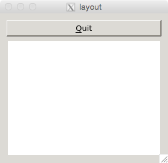

# Graphical User Interfaces with Qt

## Motivation

Lots of real world software uses graphical interfaces.

So it goes.

Don't worry.
We'll have some surreal story for you soon.

### Takeaways

- Experiment with Qt to build Graphical User Interfaces
- Appreciate the simplicity of programming Command Line Interface applications.

## Walkthrough

It's worth mentioning before we get to deep that you should spend some time looking through your starter repository's example code in addition to this walkthrough.
Qt requires a non-negligible amount of code to get anything interesting done.
We've included a few examples here, as well as a discussion of some conceptual stuff, but you'll really need to spend time looking at the example code to learn what you need to learn.

### Building Qt Projects

To make your life a little easier, the Qt framework includes a preprocessor that generates some C++ code for you.
You still have to write C++, of course.
It's just a little less.

Qt's preprocessor is called the Meta Object Compiler (`moc`).
Fortunately, you don't have to work with it (or `g++`) directly, since Qt can generate a `Makefile` for you!

So... you don't need to run `moc`, `g++`, or even make your own `Makefile`... so what *do* you have to do?

Qt uses project files, which end in `.pro` to determine how to build your projects.
You can generate a new `.pro` file for a Qt project by running the command `qmake -project`

If you already have a `.pro` file, then you can just run `qmake` to generate a `Makefile`.
Then you can run `make` to compile everything together!

Lucky you!
In this lab, your projects will come with pre-configured `.pro` files.
So, you don't have to worry about generating those.

For this lab, you just need to run `qmake` one time to generate a `Makefile`, and `make` whenever you want to build.

~~~shell
# Just need to run this once to create your Makefile
$ qmake

# ... then this whenever you want to recompile
$ make
~~~

### Parts of a Qt Application

Whenever you write a Qt application, you will instantiate **one** instance of `QApplication`.
The `QApplication` object represents your entire application.
It allows you to work with the application as a whole.
The only thing we'll be using it for is shutting our application down.
Although you instantiate the `QApplication` in `main()`, you can access it throughout your program through the `qApp` pointer (as long as you `#include<QApplication>`).

So that's nice, right?
A `QApplication` is an object that represents your entire application.
Not the windows, no buttons... it's the *whole* thing.

All of those clickable things that we all love to click: those are called **widgets**.
If you want a useful application, you can't work with just a `QApplication`.
You need to spice it up with some widgets.
Just pepper it with buttons.

BAM!

So let's consider this application:

~~~cpp
#include <QApplication>
#include <QTextEdit>

int main(int argc, char** argv)
{
  QApplication app(argc,argv);

  QTextEdit te;
  te.setWindowTitle("Not Vim");
  te.show();

  return app.exec();
}
~~~

First, we instantiate our application.
That's just dandy!

Next, we create a single `QTextEdit` widget.
We instantiate the widget just like we would instantiate any ol' C++ object.
Since it's the only widget in our application, it gets its own window.
We'll go ahead and set a window title for it.
We then ask Qt to display our text editor window using the `.show()` member function.

So we've got an **application** set up with a text editing **widget**, and we've asked Qt to show it.
In order to see our application in action, we need to ask it to run using `app.exec()`.

### Laying out your App

Alright!

That sure was an app.
It leaves a lot to be desired, though.

We can construct more interesting applications by being smart about our widgets.
We can add widgets to other widgets to create complex applications.
To tell Qt how we want our widgets positioned, we use **layouts**.

For example, let's say we want to put a quit button above our text editor (in the same window of course).
We can use a `QVBoxLayout` to **vertically** (hence the `V`) stack our widgets.

~~~cpp
// #includes left out for the sake of brevity
int main(int argc, char** argv)
{
  QApplication app(argc,argv);

  QTextEdit* te = new QTextEdit;
  QPushButton* quit = new QPushButton("&Quit");

  QVBoxLayout* layout = new QVBoxLayout;
  layout->addWidget(quit);
  layout->addWidget(te);

  QWidget window;
  window.setLayout(layout);

  window.show();

  return app.exec();
}
~~~

Now let's walk through this biz:

1. We first create our app, like normal.
2. We create a couple of widgets: our text editing widget ang our quit button.
3. We create a vertical layout and add our quit button followed by our text editor.
   This essentially tells Qt we want to create a vertical stack in our window: the quit button on top, and the editor beneath.
4. We then make a window and add our layout to it.

The rest is similar to the last example.
With layouts, we have the ability to specify how we want our widgets organized on screen.
In addition to vertical layouts there are horizontal layouts (`QBoxLayout`) and grid layouts (`QGridLayout`) and a handful of others.

So, that's dandy... but our quit button doesn't actually do anything!
To make our buttons work, we need to talk about Signals and Slots.

### Signals and Slots

Qt is **event-driven**.
It waits for stuff to happen.
Once something happens, it reacts to it.
It's up to you to decide how it reacts to stuff that happens.

#### What is a signal?

If you press a button, it emits a **signal**.
"HOLY GUACAMOLE" the button says.
"DANG DANG GOSH I DONE BEEN PRESSED!"
That's about it.

Lots of things can emit signals:

- Buttons
- Text fields
- Other widgets
- You can even emit your own signals!

All of that is dandy, but what's the point if no one is listening to you, what's the point?

#### What's is a slot?

A slot is a big ol' ear.

Just the biggest ear you can imagine.
All goofy and just a-waitin' to hear something.
The thing is -- big goofy ear ain't just listenin' for any ol' thing.
It's listening for a **specific** signal.

You can create a slot to listen to any signal.
A slot is basically just a function.
When a signal is emitted, the slot (function) is executed.

Once you've got a signal to listen to and a slot to listen for it, you can `connect()` them.

#### Connecting a Signal to a Slot

Let's talk about how we get that big ear to listen to that screaming button.

The `connect()` function connects a signal to a slot.
It takes four parameters:

- The object that is sending the signal (**Source**)
- The signal sent by that object (button pressed down, button lifted up, etc)
- The object that is receiving the signal (**Destination**)
- The slot that is receiving the signal (whatever the slot function is called)

~~~cpp
// #includes left out for the sake of brevity
int main(int argc, char** argv)
{
  QApplication app(argc,argv);

  QTextEdit* te = new QTextEdit;
  QPushButton* quit = new QPushButton("&Quit");

  QObject::connect(quit, SIGNAL(clicked()), qApp, SLOT(quit()));

  QVBoxLayout* layout = new QVBoxLayout;
  layout->addWidget(quit);
  layout->addWidget(te);

  QWidget window;
  window.setLayout(layout);

  window.show();

  return app.exec();
}
~~~

The above example is almost the same as the previous except for this line:

~~~cpp
QObject::connect(quit, SIGNAL(clicked()), qApp, SLOT(quit()));
~~~

This line `connect()`s the quit button to the `quit()` member function of `qApp`.
So what's going on here?
Let's take this parameter-by-parameter.

1. `quit` -- The object that's emitting (screaming) the signal of interest is our quit button.
   The object pointer is `quit`.
2. `SIGNAL(clicked())` -- The signal that `quit` is emitting is the `clicked()` signal to indicate it's been clicked.
   (The `SIGNAL(...)` part of it is for `moc`. Don't worry about that bit.)
3. `qApp` -- The object that's listening for the emitted signal.
   We want it to know when our `quit` button has been pressed.
4. `SLOT(quit())` -- The slot that should run whenever the signal is emitted.
   Remember that the `qApp` object represents our whole application.
   We want to call its `quit()` member function whenever our `quit` button is pressed.
   (Again, the `SLOT(...)` part of it is for `moc`, so don't worry about that.)

`connect()` is what allows a slot to run whenever a signal is emitted.
The slots are often member functions of Qt objects.
Sometimes they're Qt widgets, sometimes their not.

You can only `connect()` a signal to a slot if the signal and slot take the same parameters.
In the example above, we had no parameters to the signal and none to the slot.
Thus, we could use them together.

Let's say we had an object called `bart` that emits signal `sass` and an object `homer` with slot `strangle`.
Whenever `bart` emits `sass`, `homer` will `strangle` as a result.
However, `bart`'s `sass` has a sassy message associated with it.
That sass level is a `QString`.
We could connect `bart` and `homer` like so:

`QObject::connect(bart, SIGNAL(sass(QString)), homer, SLOT(strangle(QString)));`

We're allowed to connect that signal with that slot because they both take a single `QString`.
Whenever `bart` emits `sass`, `homer` can see the sassy message that `bart` included as a parameter through his slot.
Based on that message, `homer` can decide exactly how to react.

Just remember: no matter what parameters are involved if you create a slot, it's worthless if you don't `connect()` it to a signal.

#### Writing your own slots

Slots are easy.

Just write a class member function, and list it in your header file.
For example, if our `Homer` class has that `strangle` slot, it'll look something like this...

~~~cpp
class Homer
{
  public:
    // doop doop doop

  private slots:
    void strangle(QString sassy_message);

  private:
    // doop doop doop
};
~~~

In our C++ file, we'll write the function body for `strangle()`.
Whatever we `connect()` our slot to (probably a `Bart::sass(QString)` as previously discussed.

#### Emitting your own signals

Signals are... odd.

When you want to create your own signal, you list it in your C++ header, but you don't actually implement it in your `.cpp` file.
The `moc` handles all that crazy business for you.
For example, the `QButton` class has a `void clicked()` signal listed in the `signals:` section of its class definition.
It's something like...

~~~cpp
class QButton
{
  public:
    // A whole lotta junk

  signals:
    void clicked();

  private:
    // A whole lotta more junk
};
~~~

This tells Qt that the QButton is capable of hootin' and hollerin' about being clicked.
In the implementation file, there is no function definition for `clicked()`.
Instead, there are lines like this:

~~~cpp
emit clicked();
~~~

`emit` is used to emit a signal.
This is how the `QButton` hoots and hollers about being clicked!
If you have any slot's connected to a `QButton's `clicked()` signal, those slots will run whenever the signal is `emit`ted.

### Menus and Toolbars

By now, we've gotten a brief introduction to how to create widgets and organize them on screen.
There are a couple of additional things to be aware of: menus and toolbars.
Lots of programs have menus: file, edit, view, etc.

There's a special Qt class that comes with these things for free.
`QMainWindow` is a class for making standard applications with menus and toolbars.
The `QMainWindow`  has one big ol' widget that goes in the middle of the window and fills that window.
`setCentralWidget()` is a member function of `QMainWindow` that sets this widget.

To create your menus (File, Edit, whatever you want) you need to add them to your `QMainWindow`.
`menuBar()` is a member function that returns a pointer to the menubar, which you can use to add new menus.
Similarly, `addToolBar()` is a member function that  creates a new toolbars.

Since it's common to have a toolbar item that does the same thing as a menu item (like a save button and save menu option), there's a way to reduce the amount of code repetition.
Using a `QAction`s, you can add the same action to a menu and a toolbar.
Then you can connect that one action to various slots.

\newpage
## Questions

Name: `______________________________`

1. Briefly explain (in your own words) the relationship between the `moc`, `qmake`, and `make`. That is, what are they each used for, and how do they relate?
\vspace{8em}
2. Briefly explain (in your own words) what signals and slots are.
\vspace{8em}
3. Let's say we have an object called `zoidberg` that emits a signal called `powerful_stench()`. Whenever `zoidberg` emits `powerful_stench()`, we want another object (`everyone_nearby`) to execute a slot (`barf()`). Write a `connect()` call that connects the `powerful_stench()` signal emitted by `zoidberg` to the `barf()` slot of `everyone_nearby`.
\vspace{8em}
\newpage

## Quick Reference

### qmake

- `qmake` is a utility that manages Qt projects and generates Makefiles automatically.
- The `-project` flag tells Qt to generate a project file (ends in `.pro`) that configures the Makefile.
- `qmake` will generate a Makefile
- If you already have a `.pro` file, all you have to do to build a Qt project: run `qmake` then `make`

### Signals and Slots

- If you don't connect a signal to a slot, the slot's not going to run.
- You can also call slots like regular old member functions.
- If you have a typo in your `connect()` call, the `moc` may not catch it.

## Further Reading
