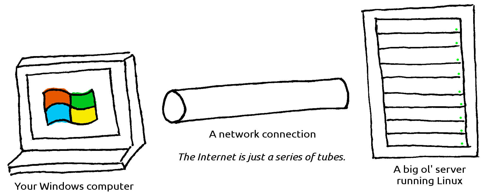
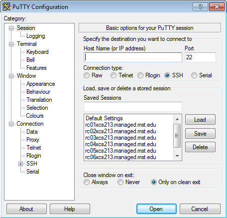
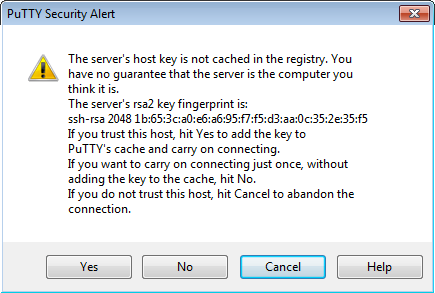
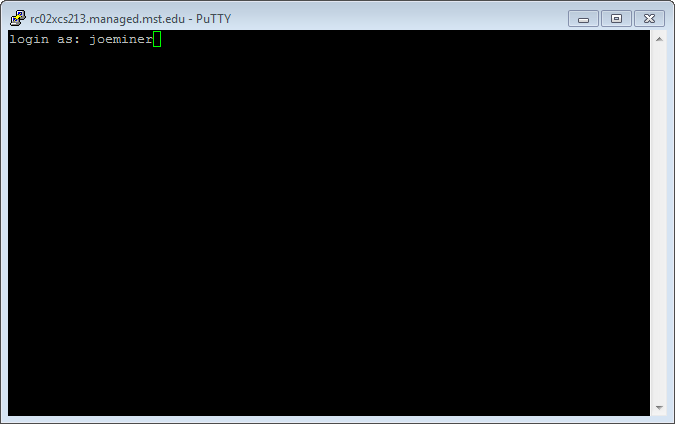
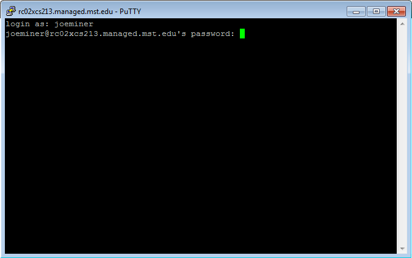
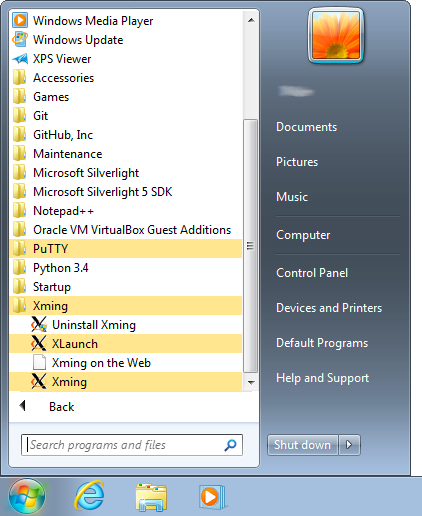
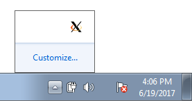
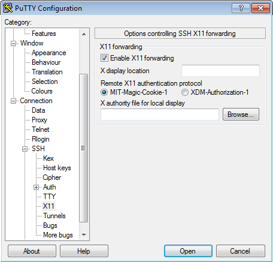
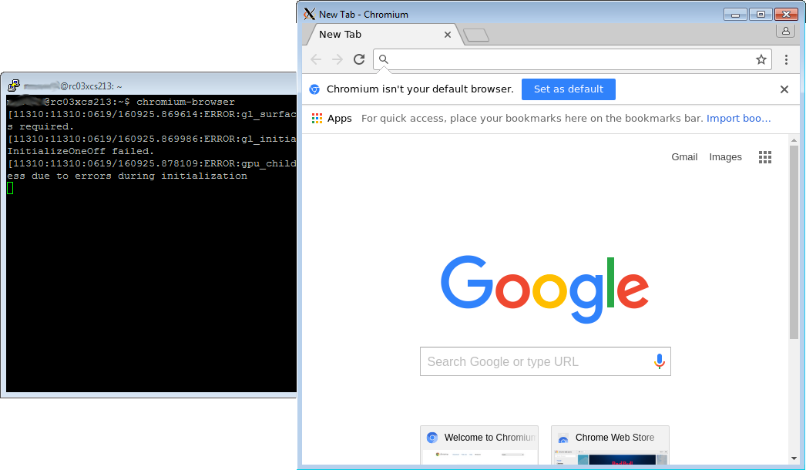

\appendix

# General PuTTY usage

In this course, we'll be writing, compiling, and running programs on the Linux operating system.
Since our campus' Computer Learning Centers are mostly equipped with computers running Windows[^another], we need a way to connect to and use computers running Linux.

To do this, we'll be making extensive use of PuTTY.

## What PuTTY **is**

PuTTY is an **s**ecure **sh**ell (SSH) client for Windows.
This means that we can use PuTTY to connect to a remote Linux computer that is running an SSH server.
Once connected, we can run programs on that remote computer.

{ width=60% }

After you use PuTTY to log in to a remote Linux computer, you can type commands into a `bash` shell.
It's important to understand that **the shell is actually running on the Linux computer**.
All programs you run in the shell actually run on that remote computer.

Those programs are *not* running on your Windows computer.

They are *not* running in PuTTY.

PuTTY is simply communicating with the Linux computer over the network to show you the shell.
PuTTY is just a kind of window[^pun] into the remote Linux computer.

## What PuTTY **is not**

To reiterate: PuTTY **is not** Linux.

Instead, PuTTY allows us to *connect* to a computer that is running Linux.
Whenever you type commands in the PuTTY shell, you're actually typing them in `bash`, which is running on the Linux server.
Again, PuTTY is just a kind of window into the remote Linux computer.

## How to Use PuTTY

### Basics

After you log into a CLC Windows computer, simply locate PuTTY in the list of programs and start it.
It should look like Figure \ref{putty-initial}.

{ width=60% }

Once PuTTY is open, simply pick a connection configuration from the list.
Click the configuration you'd like to load and press the \menu{Load} button.
Once you do that, you should see the corresponding hostname in the text field as shown in Figure \ref{putty-loaded}.
You can also create your own configuration or modify the existing configurations and save them using the \menu{Save} button.

{ width=60% }

Once your configuration is loaded and all the settings look right, press the \menu{Open} button to start the connection.
PuTTY will start communicating with the remote computer specified by the hostname.
If it's unable to connect, PuTTY will complain.

If you've never connected to a particular Linux hostname before, PuTTY will warn you with a message similar to Figure \ref{putty-key-confirmation}.
It will show you its SSH fingerprint[^google] and ask that you confirm the connection.

{ width=60% }

If you confirm the connection, PuTTY just needs to know your login credentials.
It'll start by asking for your username (Figure \ref {putty-username}) followed by your password (Figure \ref{putty-password}).

{ width=60% }

{ width=60% }

Assuming you entered your credentials correctly, PuTTY will present you with a shell as in Figure \ref{putty-logged-in}.
Take note of the number of users on your host.
If there are a lot of users connected to the computer you're using, it'll be slower.
You might consider trying a different hostname if you find the one you're using is sluggish.

{ width=60% }

### Other Tips

Here are a handful of tips:

- You have to be on the campus network to connect to the campus Linux hosts.
    - You can use any computer that is connected to the campus Ethernet or wireless networks.
      That includes CLC computers, your own desktop, your friend's laptop, etc.
    - You can setup a VPN connection to connect to the campus network from off campus.
      Refer to IT's help pages to set that up.
- IT's has a list of the Linux hostnames on their website: http://it.mst.edu/services/linux/hostnames/
  Since the PuTTY default only lists the first 16 or so, most people use those.
  Try using the higher-numbered machines.
  They often have far fewer users on them, and thus, they're notably faster.
  When you connect, the Linux host welcome message will tell you how many users are connected.

### Useful Settings

### Clipboard Tips

# X-forwarding

True, we use the shell a lot in this course, but every now and then we have to run programs that have GUIs.
When we're running GUI programs on *Windows* (such as Notepad or Microsoft Word), it's easy.
Just find the program in your Start menu, click it, and off you go.
If you need to start a GUI program on a remote Linux computer, though, things are more... complex.

## Remote GUIs

Linux uses the X Window System to display GUIs and interact with you, the user.
Basically, GUI programs work like this:

> **GUI Program**: Hey, X Server. I need you to draw a window on the screen for my user.
>
> **X Server**: What's in it for me?
>
> **X Server**: I'm just kidding. What's it look like?
>
> **GUI Program**: Well, it's got a text box here, and some shapes over there.
>
> **X Server**: That sounds great. I'll draw that on this `display` over here.

X Server then sends a bunch of data to a `display`.
If that Linux computer has a monitor connected, the data would be sent to that monitor.

As it turns out, you can ask X Server to send that display data over a network.
If you ask nicely, PuTTY can request that X Server send that display data to your Windows computer.
Together with a program called Xming, we can see the windows (and such) that would have been displayed if we connected a monitor directly to the Linux computer.

But it's all remote.

## Configuring X-forwarding

As previously mentioned, we're still going to use PuTTY to connect to the remote host.
However, PuTTY doesn't know how to draw on the screen.
All it can do is the shell stuff.

To help PuTTY out, we need to start its partner in crime: Xming.
Find **Xming** within your start menu (as in Figure \ref{xming-start-menu}) and click it.
Don't start XLaunch or anything else.
We just want Xming.

You only need to do this one time after you log in.
Xming will run in the background until you stop it or log off.
You can check to see if Xming is running by looking in your task bar as shown in Figure \ref{xming-running}.
If you see the logo down there, there's no need to start Xming again.

Now that Xming is running, we need to tell PuTTY to send all that display data to Xming.
After you load a Putty configuration but before you connect, you need to **make sure** that X11 Forwarding is enabled.

So:

1. Open PuTTY
2. Click a hostname in the list
3. Click the \menu{Load} button
4. Find the X11 Forwarding configuration and make sure it is enabled as shown in Figure \ref{putty-enable-x-forwarding}.

If Xming is running and X11 Forwarding is enabled, you can start your PuTTY connection by pressing the \menu{Open} button.
PuTTY will open a shell like normal.
Nothing actually looks different until you try to start a program.

Try running `gedit` (a GUI text editor for Linux), `firefox`, or `chromium-browser`.
These are all GUI programs and should start up.
Figure \ref{xming-started-gui}

It's important to keep in mind that while your GUI program is running, your shell will be busy.
It's just like any other program you start in your shell.
Until you close the GUI program, your shell will be unavailable.
You may find it useful to have a couple of PuTTY windows open, so that you can multitask.

# Markdown

# Parsing command-line arguments in C++

# Submitting homework with Git

[^another]: Windows is also an operating system.
[^google]: Uh... Google it.
[^pun]: Pun intended.

<!--  LocalWords:  PuTTY
 -->
